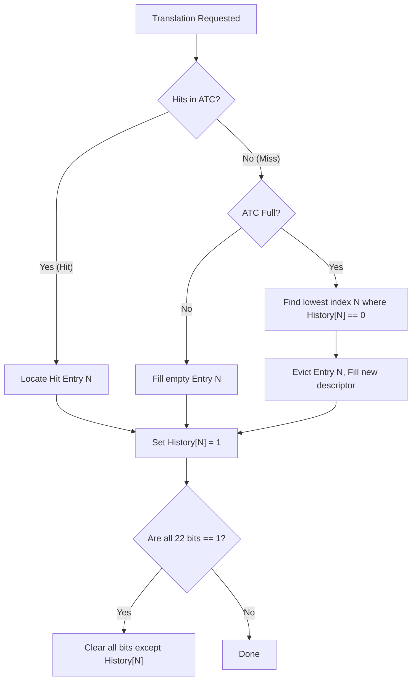
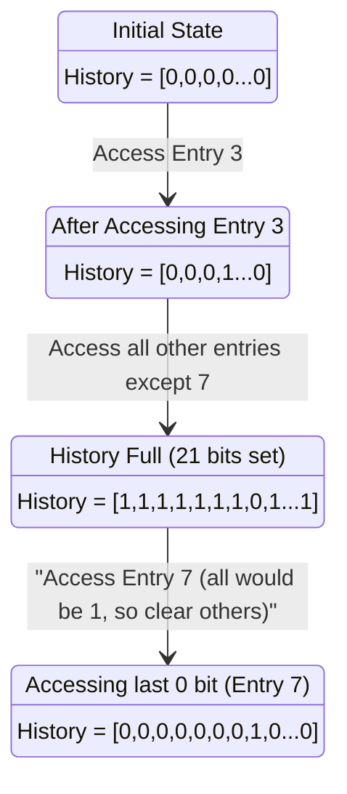

# Musashi MMU Full Compliance Design — 68030/040/060

## Goal

Bring Musashi's PMMU implementation to full Motorola specification compliance across the 68030, 68040, and 68060 CPU types, enabling use as a golden reference model for RTL co-simulation of MiSTer FPGA cores.

## Current State Summary

| Feature | 030 | 040 | 060 |
|---|---|---|---|
| PMOVE (register access) | ✅ TC/SRP/CRP/MMUSR | N/A (uses MOVEC) | N/A (uses MOVEC) |
| MOVEC MMU regs | N/A | ✅ TC/ITT/DTT/URP/SRP stored | ✅ Same + 060 guards |
| Page table walk | ⚠️ Basic 3-level | ❌ None | ❌ None |
| PFLUSH | ❌ Stub | ❌ Stub | N/A (F-line trap ✅) |
| PTEST | ❌ Stub | ❌ None | N/A (F-line trap ✅) |
| PLOAD | ❌ Stub | N/A | N/A |
| TT registers (030) | ❌ Missing entirely | — | — |
| ATC/TLB | ❌ None | ❌ None | ❌ None |
| Access fault exceptions | ❌ Uses fatalerror() | ❌ None | ❌ None |
| Write protection | ❌ Ignored | ❌ None | ❌ None |
| Descriptor U/M bits | ❌ Never written | ❌ N/A | ❌ N/A |
| MMUSR population | ❌ Never set | ❌ TODO comment | ❌ N/A |
| PLPA | — | — | ✅ No-op (correct without full MMU) |

---

## Emulator Comparison Analysis

Three emulator codebases were analyzed for reference implementations:

### 1. MAME's Evolved Musashi (⭐ Primary Reference)

**Source**: [github.com/mamedev/mame/.../m68kmmu.h](https://github.com/mamedev/mame/blob/master/src/devices/cpu/m68000/m68kmmu.h)  
**Authors**: R. Belmont, Hans Ostermeyer, Sven Schnelle  
**Lineage**: Direct fork of the same Musashi codebase we're using

MAME's `m68kmmu.h` has evolved far beyond our copy. Key features present in MAME but missing from ours:

| Feature | MAME | Our Musashi |
|---|---|---|
| ATC (22-entry, FC-tagged, round-robin) | ✅ `pmmu_atc_add/lookup/flush` | ❌ |
| Transparent Translation (TT0/TT1) | ✅ `pmmu_match_tt()` | ❌ |
| PFLUSH (all 3 forms: all/fc/fc+ea) | ✅ `pmmu_atc_flush_fc_ea()` | ❌ Stub |
| PTEST (full walk + MMUSR + A-reg) | ✅ `m68851_ptest()` | ❌ Stub |
| PLOAD (ATC preload) | ✅ `m68851_pload()` | ❌ Stub |
| MMUSR bit population | ✅ `update_sr<>()` template | ❌ Never set |
| Write protection checking | ✅ Bus error on WP violation | ❌ Ignored |
| U/M bit writeback to descriptors | ✅ `update_descriptor()` | ❌ Never written |
| FC threading through walker | ✅ FC parameter everywhere | ❌ Ignored |
| Page size from TC PS field | ✅ `(m_mmu_tc >> 20) & 0xf` | ❌ Hardcoded |
| Bus error recovery (not fatalerror) | ✅ `pmmu_set_buserror()` | ❌ `fatalerror()` |
| 040 table walker | ✅ `pmmu_translate_addr_with_fc_040()` | ❌ None |
| Indirect descriptors | ✅ Handled in walk loop | ❌ Not handled |
| FC level select (SFC/DFC/Dn/#imm) | ✅ `fc_from_modes()` | ❌ Not decoded |
| TC validation (bits must sum to 32) | ✅ Validates on PMOVE to TC | ❌ No validation |
| PMOVE TT0/TT1 | ✅ Cases 0x02, 0x03 | ❌ Missing |
| FD bit (flush disable) on PMOVE | ✅ Conditional `pmmu_atc_flush()` | ❌ Parsed but ignored |
| Apple HMMU (Mac II/LC) | ✅ `hmmu_translate_addr()` | ❌ |

**Key technique — templated walk**: MAME uses `pmmu_walk_tables<ptest>()` and `pmmu_translate_addr_with_fc<ptest, pload>()` templates to share the walk logic between normal translation, PTEST, and PLOAD with zero-cost compile-time branching.

> [!IMPORTANT]  
> **Recommendation**: Port MAME's `m68kmmu.h` as the primary implementation base. Same codebase lineage means minimal integration friction. Their ATC, TT matching, PFLUSH/PTEST/PLOAD, U/M writeback, and 040 walker are production-tested across dozens of emulated systems.

### 2. WinUAE (Gold Standard for Accuracy Validation)

**Source**: [github.com/tonioni/WinUAE](https://github.com/tonioni/WinUAE) — `cpummu030.cpp`  
**Author**: Toni Wilen  
**Architecture**: C++ class-based, fundamentally different structure from Musashi

WinUAE is the most accurate Amiga emulator and has been validated using the UAE 680x0 CPU Tester, which verifies register states, exception stack frames, and instruction behavior against real hardware.

Key WinUAE-specific features:
- **Separate `cpummu030.cpp`** for 030-specific MMU (more complex than 040/060)
- **Extra translation caches** beyond the 22-entry ATC for performance
- **EC-model partial MMU** (TT registers only for EC030)
- **JIT incompatibility** — MMU emulation requires interpretive core
- **Bus error frame accuracy** — Full 46-word 030 format $A/$B frames

> [!TIP]
> WinUAE is architecturally too different to port directly, but serves as the **validation oracle**. We should compare Musashi's translation results against WinUAE's for the same page table setups.

### 3. Hatari (Same Core as WinUAE)

**Source**: [github.com/hatari/hatari](https://github.com/hatari/hatari)  
**MMU**: Integrates the WinUAE CPU core directly

Hatari uses the same WinUAE CPU core for its Atari Falcon (68030) emulation. No meaningful MMU accuracy difference from WinUAE — differences arise only from surrounding hardware emulation (Amiga chipset vs Atari ST/TT/Falcon).

### Emulator Comparison Summary

| Capability | Our Musashi | MAME Musashi | WinUAE/Hatari |
|---|---|---|---|
| 030 Table Walk | ⚠️ Basic | ✅ Full | ✅ Full |
| 030 ATC | ❌ | ✅ 22-entry RR | ✅ 22-entry + extra caches |
| 030 TT0/TT1 | ❌ | ✅ | ✅ |
| 030 PFLUSH | ❌ | ✅ | ✅ |
| 030 PTEST | ❌ | ✅ | ✅ |
| 030 PLOAD | ❌ | ✅ | ✅ |
| 040 Table Walk | ❌ | ✅ | ✅ |
| 040 PTEST/PFLUSH | ❌ | ✅ | ✅ |
| 060 MMU | ❌ | Partial | ✅ |
| Access Fault Frames | ❌ | ✅ Partial | ✅ Full |
| Descriptor U/M bits | ❌ | ✅ | ✅ |
| Bus Error Recovery | ❌ | ✅ | ✅ |
| Co-sim Callbacks | ❌ | ❌ | ❌ |
| Porting Effort | — | Low (same lineage) | High (different arch) |

---

## Proposed Changes

### Phase 1: Shared ATC Infrastructure

> [!IMPORTANT]
> The ATC is the foundation everything else depends on. All three CPUs use an address translation cache, though with different structures.

#### [NEW] `m68kmmu_atc.h` — Address Translation Cache

Software model of the ATC, parameterized per CPU generation:

```c
typedef struct {
    uint32 logical_addr;   /* Logical address tag (page-aligned) */
    uint32 physical_addr;  /* Physical address (page-aligned) */
    uint8  valid;          /* Entry valid */
    uint8  write_protect;  /* Write-protected */
    uint8  modified;       /* Modified (dirty) bit */
    uint8  cache_mode;     /* CM bits (00=WT, 01=CB, 10=CI-precise, 11=CI-imprecise) */
    uint8  supervisor;     /* S bit — supervisor-only */
    uint8  fc;             /* Function code (030 only) */
} m68k_atc_entry;
```

- **030**: 22-entry fully-associative, FC-qualified, variable page size (256B–32KB)
- **040**: 64-entry 4-way set-associative, separate IATC/DATC, fixed 4KB/8KB pages
- **060**: Same structure as 040 but with PLPA integration

**Replacement Policy** (per MC68030UM §9.7.1.1):

Motorola documented the 030 ATC replacement as *"a variation of the least recently used algorithm"* — an architectural summary, not an engineering specification. The exact PLRU state machine was never publicly documented. The 040 explicitly uses a 2-bit round-robin counter.

For co-simulation, the replacement policy **must be configurable**:

```c
/* Default: FIFO (deterministic, matches MAME's round-robin) */
#define M68K_ATC_REPLACE_FIFO     0
#define M68K_ATC_REPLACE_LRU      1
#define M68K_ATC_REPLACE_CALLBACK 2

/* Callback for RTL-synchronized eviction */
typedef int (*m68k_atc_replace_callback)(
    const m68k_atc_entry *entries,  /* Current ATC state */
    int num_entries,                /* 22 for 030 */
    uint32 new_logical_addr,        /* Address being inserted */
    uint8  new_fc                   /* Function code */
);
/* Returns: index of entry to evict */

void m68k_set_atc_replace_policy(int policy);
void m68k_set_atc_replace_callback(m68k_atc_replace_callback cb);
```

> [!IMPORTANT]
> **Rationale**: If Musashi implements strict True LRU but the FPGA RTL implements Tree-based PLRU, they will eventually disagree on which entry to evict. When the guest OS accesses an address that Musashi kept but the RTL evicted, the RTL triggers a table walk while Musashi reports an ATC hit — instant co-sim desync. The callback hook lets the testbench force Musashi to use the FPGA's exact eviction logic.

**Default Implementation: Bit-PLRU (MRU approximation)**

The recommended default (when no callback is installed) is the Bit-PLRU algorithm, which matches the hardware behaviour described in §9.7.1.1 using a single 32-bit integer as a 22-bit history register:

1. Maintain a 22-bit History Register (`mmu_atc_history`, one bit per entry), initialized to all `0`s.
2. On every ATC access (both hits and fills), set the accessed entry's corresponding history bit to `1`.
3. If setting this bit would cause all 22 bits to become `1`, instead set *only* the currently accessed entry's bit to `1`, and clear the other 21 bits to `0`.
4. When the ATC is full and an eviction is required, scan the History Register (from index 0 to 21) and select the first entry whose history bit is `0` as the victim.





> [!NOTE]
> `mmu_atc_history` must be reset to `0` in both `pmmu_atc_flush()` and `m68k_pulse_reset()`.

API:
```c
int  atc_lookup(uint32 addr, uint fc, int write, m68k_atc_entry *result);
void atc_insert(uint32 logical, uint32 physical, uint flags);
void atc_flush_all(void);
void atc_flush_fc(uint fc);              /* 030 only */
void atc_flush_addr(uint32 addr, uint fc); /* 030 PFLUSH variants */
void atc_flush_page(uint32 addr);        /* 040 PFLUSHA/PFLUSH */
```

---

### Phase 2: 68030 MMU Compliance

Reference: *MC68030 User's Manual*, Sections 9 (PMMU) and 10 (Instruction Set)

#### [MODIFY] `m68kmmu.h` — Major rewrite

**2.1 — Transparent Translation (TT0/TT1)**

Add to CPU struct in `m68kcpu.h`:
```c
uint mmu_tt0;  /* Transparent Translation Register 0 */
uint mmu_tt1;  /* Transparent Translation Register 1 */
```

Add TT matching before table walk:
```c
static int tt_match(uint32 addr, uint fc, uint32 tt_reg) {
    if (!(tt_reg & 0x8000)) return 0;  /* E bit — disabled */
    uint8 base = (tt_reg >> 24) & 0xFF;
    uint8 mask = (tt_reg >> 16) & 0xFF;
    uint8 fc_base = (tt_reg >> 4) & 0x7;
    uint8 fc_mask = tt_reg & 0x7;      /* actually E/S/FC2-0 encoding */
    /* Match: (addr[31:24] & ~mask) == (base & ~mask) AND fc matches */
    return ((addr >> 24) & ~mask) == (base & ~mask) && fc_matches(fc, tt_reg);
}
```

**2.2 — PMOVE: Add TT0/TT1 and missing register support**

Extend the PMOVE case 2 handler to support register codes 2 (TT0) and 3 (TT1) in the MC68030 form:
```
Register codes for MC68030 PMOVE (modes>>10 & 7):
0 = TC, 2 = SRP, 3 = CRP, (case 3 modes>>13) = MMUSR
030-specific: TT0 via register code 2 in form 0, TT1 via register code 3 in form 0
```

**2.3 — PFLUSH: Full implementation**

Per MC68030 UM §9.6.2, PFLUSH has three forms:

| Form | Encoding | Action |
|---|---|---|
| PFLUSH FC,#mask | `001xxx0xxxxxxxxx` | Flush ATC entries matching FC and mask in EA's space |
| PFLUSH FC,#mask,(ea) | Same + EA | Flush entries matching FC, mask, AND effective address |
| PFLUSHA | `001000x000000000` specific | Flush entire ATC |

Implementation:
```c
case PFLUSH:
    fc = extract_fc(modes);
    mask = (modes >> 5) & 0xF;
    if (has_ea)
        atc_flush_addr(ea_val, fc);
    else
        atc_flush_fc_mask(fc, mask);
    break;
case PFLUSHA:
    atc_flush_all();
    break;
```

**2.4 — PTEST: Full implementation**

Per MC68030 UM §9.6.3:
```c
case PTEST:
    level = (modes >> 10) & 7;   /* Number of levels to search */
    rw = (modes >> 9) & 1;       /* Read/Write */
    fc = extract_fc(modes);
    a_reg = (modes >> 5) & 7;    /* An for MMUSR result (if bit 8 set) */

    /* Perform table walk up to 'level' levels */
    mmusr = pmmu_test_addr(ea_val, fc, rw, level);

    /* If A-register field specified, store last descriptor address */
    if (modes & 0x100)
        REG_A[a_reg] = last_descriptor_addr;

    m68ki_cpu.mmu_sr = mmusr;
    break;
```

MMUSR bit layout (030):
```
Bit 15: Bus Error
Bit 14: Limit violation
Bit 13: Supervisor only
Bit 12: Write protected
Bit 11: Invalid
Bit 10: Modified
Bit  9: Transparent (TT match)
Bits 2-0: Level number reached
```

**2.5 — PLOAD: ATC preload**

```c
case PLOAD:
    fc = extract_fc(modes);
    rw = (modes >> 9) & 1;
    /* Perform full table walk and load result into ATC */
    pmmu_translate_and_load_atc(ea_val, fc, rw);
    break;
```

**2.6 — Table walker improvements**

Current `pmmu_translate_addr()` deficiencies to fix:

1. **Bus error on invalid descriptors** — Replace `fatalerror()` with proper bus error exception via `m68ki_exception_bus_error()` using setjmp/longjmp recovery
2. **Write-protect checking** — Check W bit in page/table descriptors; generate bus error on write to WP page
3. **U/M bit writeback** — Set Used bit on access, Modified bit on write, write descriptor back to memory
4. **Function code passing** — Thread FC through the walker for TT matching and ATC tagging
5. **Page size from TC** — Extract PS field and use it for page offset masking instead of hardcoded `0xffffff00`
6. **Berr-safe recovery** — Wrap all descriptor reads in bus-error-safe accessors

#### [MODIFY] `m68kcpu.h`

- Add `mmu_tt0`, `mmu_tt1` to `m68ki_cpu_core`
- Modify `m68ki_read_*_fc()` / `m68ki_write_*_fc()` to pass FC and write-mode to the translation layer
- Add `atc_030[]` array (22 entries) to CPU struct

#### [MODIFY] `m68k_in.c`

- PMOVE to/from TT0/TT1 via MOVEC for 030 (register IDs `0x003`–`0x005` mapping)

---

### Phase 3: 68040 MMU Implementation

Reference: *MC68040 User's Manual*, Section 9

The 040 MMU is fundamentally different from the 030:
- Fixed 4KB or 8KB page sizes (TC bit 14)
- 3-level tree: Root → Pointer → Page
- Separate URP (user) and SRP (supervisor) root pointers
- No coprocessor instructions — all via MOVEC
- PFLUSH/PFLUSHA are encoded differently (line-F, `F500` group)
- PTEST is a MOVEC-triggered operation writing MMUSR

#### [NEW] `m68kmmu040.h` — 040/060 table walker

```c
typedef struct {
    uint32 physical;
    uint8  cache_mode;   /* CM[1:0] */
    uint8  write_protect;
    uint8  supervisor;
    uint8  modified;
    uint8  used;
    uint8  global;       /* G bit — don't flush on PFLUSHA */
    uint8  resident;     /* R bit — page is resident */
    int    fault;        /* Access fault occurred */
    uint16 mmusr;        /* Status for PTEST */
} m68k_040_translate_result;

m68k_040_translate_result pmmu_translate_addr_040(uint32 addr, int fc, int write);
```

**3.1 — 040 Table Walk**

```
TC bit 15 (E): Enable MMU
TC bit 14 (P): Page size (0=4KB, 1=8KB)

Root table pointer = (FC & 4) ? SRP : URP  (supervisor vs user)

Level 1 (Root):    addr[31:25] → 7-bit index → 128 entries × 4 bytes
Level 2 (Pointer): addr[24:18] → 7-bit index → 128 entries × 4 bytes
Level 3 (Page):    addr[17:12] → 6-bit index (4KB) or addr[17:13] → 5-bit (8KB)

Descriptor types (bits 1:0):
  00 = Invalid
  01 = Resident page descriptor (terminal)
  10 = Indirect descriptor (pointer to actual descriptor)
  11 = Resident pointer/page with Used bit management
```

**3.2 — 040 Transparent Translation**

ITT0/ITT1 for instruction accesses, DTT0/DTT1 for data. Same format as 030 TT but checked BEFORE the table walk. Already stored in CPU struct.

```c
int tt040_match(uint32 addr, int fc, int write, uint32 tt_reg) {
    if (!(tt_reg & 0x8000)) return 0;
    uint8 base = (tt_reg >> 24);
    uint8 mask = (tt_reg >> 16) & 0xFF;
    int s_field = (tt_reg >> 13) & 3;
    /* S field: 00=match user, 01=match super, 1x=match both */
    if (s_field == 0 && (fc & 4)) return 0;
    if (s_field == 1 && !(fc & 4)) return 0;
    return ((addr >> 24) & ~mask) == (base & ~mask);
}
```

**3.3 — 040 PFLUSH/PFLUSHA**

Already decoded in `m68k_in.c:8622` (pflush opcode handler). Currently stubbed. Implement:

```c
M68KMAKE_OP(pflush, 32, ., .) {
    if (CPU_TYPE_IS_040_PLUS(CPU_TYPE) && !CPU_TYPE_IS_060_PLUS(CPU_TYPE)) {
        if (FLAG_S) {
            uint16 ir = REG_IR;
            int opmode = (ir >> 3) & 3;
            int reg = ir & 7;
            switch (opmode) {
                case 0: /* PFLUSHN (An) — flush non-global entries matching addr */
                    atc_flush_page_nonglobal(REG_A[reg]);
                    break;
                case 1: /* PFLUSH (An) — flush all entries matching addr */
                    atc_flush_page(REG_A[reg]);
                    break;
                case 2: /* PFLUSHAN — flush all non-global */
                    atc_flush_all_nonglobal();
                    break;
                case 3: /* PFLUSHA — flush all */
                    atc_flush_all();
                    break;
            }
            USE_CYCLES(4);
            return;
        }
        m68ki_exception_privilege_violation();
        return;
    }
    /* ... existing 060 PLPA handling ... */
}
```

**3.4 — 040 PTEST**

PTEST on 040 uses a line-F encoding (`F548`+reg for PTESTR, `F568`+reg for PTESTW). Currently not decoded at all.

Add opcode table entry and handler:
```c
M68KMAKE_OP(ptest040, 0, ., .) {
    if (CPU_TYPE_IS_040_PLUS(CPU_TYPE) && FLAG_S) {
        int reg = REG_IR & 7;
        int write = (REG_IR >> 5) & 1;
        int fc = FLAG_S ? 5 : 1;  /* Simplified — real FC from SFC/DFC */
        m68k_040_translate_result res = pmmu_translate_addr_040(REG_A[reg], fc, write);
        /* Store MMUSR via MOVEC 0x805 readable */
        m68ki_cpu.mmu040_mmusr = res.mmusr;
        USE_CYCLES(8);
        return;
    }
    m68ki_exception_1111();
}
```

040 MMUSR layout:
```
Bits 31-12: Physical address [31:12]
Bit 11: Bus error
Bit 10: Global
Bit 9:  Undefined (68060 uses for U1/U0 page bits)
Bit 8:  Supervisor
Bit 7:  Cache mode bit 1
Bit 6:  Cache mode bit 0
Bit 5:  Modified
Bit 4:  Undefined
Bit 3:  Write protected
Bit 2:  Transparent Translation hit
Bit 1:  Resident
Bit 0:  Not used
```

#### [MODIFY] `m68kcpu.h`

- Add `uint mmu040_mmusr` to CPU struct
- Fix MOVEC case `0x805` (currently `/* TODO */`) to read/write `mmu040_mmusr`

#### [MODIFY] `m68k_in.c`

- Add PTEST040 opcode entry: mask `0xFFF8`, match `0xF548` (PTESTR) and `0xF568` (PTESTW)
- Hook 040 translation into memory access paths (conditional on CPU type)

---

### Phase 4: 68060 MMU Specifics

Reference: *MC68060 User's Manual*, Section 4

The 060 MMU is nearly identical to the 040 MMU with these differences:

**4.1 — Already correct in current code:**
- ✅ PTEST/PFLUSH/PMOVE/PBcc → F-line trap (vector 11)
- ✅ MOVEC MMUSR → illegal instruction on 060
- ✅ PLPA no-op (correct for identity-mapped systems)
- ✅ PCR/BUSCR register access

**4.2 — Remaining work:**

| Item | Change |
|---|---|
| PLPA (real translation) | Modify existing PLPA handler to call `pmmu_translate_addr_040()` and write result to `An` |
| 060 PFLUSH encoding | The 060 uses same `F5xx` encoding as 040 but with slightly different semantics (no PFLUSHN) |
| 060 table walk | Reuse 040 walker — same 3-level URP/SRP structure |
| 060 branch cache | Not needed for co-sim (transparent to software) |

#### [MODIFY] `m68k_in.c` pflush handler

Add 060-specific PFLUSH support (060 keeps PFLUSHA but drops per-page PFLUSH):
```c
if (CPU_TYPE_IS_060_PLUS(CPU_TYPE)) {
    /* 060 only supports PFLUSHA (flush all) via F518 area */
    /* PFLUSHAN via F510 */
    /* Per-page PFLUSH/PFLUSHN trap to F-line */
}
```

---

### Phase 5: Access Fault Exception Frames

> [!WARNING]
> Correct exception stack frames are essential for OS compatibility. However, perfect reproduction of internal pipeline state fields between an FPGA soft-core and a C emulator is practically impossible — even Motorola's own 030 silicon revisions had variations in these fields.

**Strategy: Architectural fidelity + co-sim masking**

**5.1 — 030 Bus Error (Format $A / $B)**

The 030 pushes a 46-word stack frame. Implementation approach:
1. **Build the full 46-word frame** so the stack pointer is adjusted correctly
2. **Populate architectural fields with 100% fidelity**:
   - Special Status Word (SSW) — R/W, FC, size, fault type
   - Fault Address
   - Data Output Buffer
   - PC and SR
3. **Fill internal pipeline fields with `0x0000`** (or `0xDEAD` for debug builds)
   - Internal pipeline stage registers
   - Microsequencer state
   - These are implementation-specific and no OS reads them

**What OSes actually need**: Linux, NetBSD, AmigaOS (Enforcer), and Mac OS rely exclusively on SSW, Fault Address, Data Output Buffer, and PC/SR. They do not read the internal pipeline registers.

**5.2 — 040 Access Fault (Format $7)**

The 040 pushes a 30-word stack frame:
- Effective address, FSLW (Fault Status Long Word)
- SSW encoding different from 030
- Fewer internal fields than 030 — more straightforward

**5.3 — 060 Access Fault (Format $4)**

The 060 pushes a simplified 8-word frame:
- FSLW with 060-specific bit definitions
- Fault address
- Simplest of the three — no undocumented pipeline state

**Co-Simulation Fault Comparison**:

```c
/* Unified fault info structure for all CPU types */
typedef struct {
    uint32 fault_addr;
    uint8  access_type;  /* 0=read, 1=write */
    uint8  fc;           /* Function code */
    uint8  fault_type;   /* 0=invalid, 1=wp, 2=supervisor */
} m68k_mmu_fault_info;
```

> [!IMPORTANT]
> **Co-sim masking requirement**: The verification harness MUST implement a stack frame comparison mask that ignores the internal pipeline state words when a Bus Error exception is taken. Without this, the co-sim will instantly fail on the first page fault.

```c
/* Co-sim: 030 bus error frame word-level comparison mask */
/* 1 = compare this word, 0 = ignore (internal pipeline state) */
static const uint8 berr_frame_030_mask[46] = {
    1, 1,   /* SR, PC high */
    1, 1,   /* PC low, Format/Vector */
    1, 1,   /* SSW */
    0, 0,   /* Internal pipeline stage A */
    0, 0,   /* Internal pipeline stage B */
    1, 1,   /* Fault address */
    0, 0, 0, 0, 0, 0, 0, 0,  /* Internal (12-19) */
    1, 1,   /* Data output buffer */
    0, 0, 0, 0, 0, 0, 0, 0,  /* Internal (22-29) */
    0, 0, 0, 0, 0, 0, 0, 0,  /* Internal (30-37) */
    0, 0, 0, 0, 0, 0, 0, 0,  /* Internal (38-45) */
};
```

Each CPU type builds its own stack frame format from the unified fault info.

---

### Phase 6: Co-Simulation Interface

#### [NEW] `m68k_mmu_cosim.h` — RTL co-simulation hooks

```c
/* Callback fired on every MMU translation for RTL comparison */
typedef void (*m68k_mmu_translate_callback)(
    uint32 logical_addr,
    uint32 physical_addr,
    uint8  fc,
    uint8  access_type,   /* 0=read, 1=write */
    uint8  cache_mode,
    uint8  from_atc,      /* 1=ATC hit, 0=table walk */
    uint16 mmusr           /* Status register state after translation */
);

/* Callback on ATC modification */
typedef void (*m68k_mmu_atc_callback)(
    int    operation,      /* 0=insert, 1=flush_entry, 2=flush_all */
    uint32 logical_addr,
    uint32 physical_addr
);

/* Callback on access fault */
typedef void (*m68k_mmu_fault_callback)(
    uint32 fault_addr,
    uint8  fc,
    uint8  access_type,
    uint8  fault_type
);

void m68k_set_mmu_translate_callback(m68k_mmu_translate_callback cb);
void m68k_set_mmu_atc_callback(m68k_mmu_atc_callback cb);
void m68k_set_mmu_fault_callback(m68k_mmu_fault_callback cb);
```

This allows the RTL testbench to:
1. Compare every translated address against the HDL MMU output
2. Verify ATC state matches the RTL TLB state
3. Verify fault conditions match exactly

#### [MODIFY] `m68k.h` — Public API additions

```c
/* MMU register access for co-sim state comparison */
unsigned int m68k_get_mmu_reg(m68k_mmu_register_t reg);
void m68k_set_mmu_reg(m68k_mmu_register_t reg, unsigned int value);

/* ATC dump for state comparison */
int m68k_get_atc_entries(m68k_atc_entry *entries, int max_entries);
```

---

## File Change Summary

| File | Action | Description |
|---|---|---|
| `m68kmmu_atc.h` | **NEW** | Shared ATC model (030/040/060) |
| `m68kmmu040.h` | **NEW** | 040/060 table walker |
| `m68k_mmu_cosim.h` | **NEW** | Co-simulation callback interface |
| `m68kmmu.h` | **MODIFY** | 030: PFLUSH, PTEST, PLOAD, TT matching, walker fixes |
| `m68kcpu.h` | **MODIFY** | Add TT0/TT1, ATC arrays, mmu040_mmusr, fault info to CPU struct |
| `m68k_in.c` | **MODIFY** | 040 PTEST opcodes, PFLUSH real impl, PLPA real translation |
| `m68k.h` | **MODIFY** | Public MMU register API, co-sim callbacks |
| `m68kcpu.c` | **MODIFY** | Reset: clear ATC, initialize TT regs |
| `m68kdasm.c` | **MODIFY** | Disassembly for PTEST040, improved PFLUSH output |
| `m68kconf.h` | **MODIFY** | Add `M68K_MMU_COSIM` compile-time toggle |

---

## Verification Plan

### Unit Tests (per phase)

| Test | CPU | Validates |
|---|---|---|
| `test/mc68030/pmove_tt.s` | 030 | PMOVE to/from TT0, TT1 |
| `test/mc68030/pflush_all.s` | 030 | PFLUSHA clears ATC |
| `test/mc68030/pflush_fc.s` | 030 | PFLUSH with FC matching |
| `test/mc68030/ptest_walk.s` | 030 | PTEST walks N levels, populates MMUSR |
| `test/mc68030/ptest_wp.s` | 030 | PTEST detects write-protect |
| `test/mc68030/pload_atc.s` | 030 | PLOAD preloads ATC entry |
| `test/mc68030/tt_match.s` | 030 | TT0/TT1 transparent translation bypass |
| `test/mc68030/wp_fault.s` | 030 | Write to WP page → bus error |
| `test/mc68040/tablewalk.s` | 040 | 3-level walk, 4KB and 8KB pages |
| `test/mc68040/ptest_040.s` | 040 | PTESTR/PTESTW → MMUSR |
| `test/mc68040/pflush_040.s` | 040 | PFLUSH/PFLUSHA/PFLUSHN/PFLUSHAN |
| `test/mc68040/tt_040.s` | 040 | ITT0/ITT1/DTT0/DTT1 matching |
| `test/mc68040/access_fault.s` | 040 | Invalid page → access fault, format $7 frame |
| `test/mc68060/plpa_real.s` | 060 | PLPA returns physical address from walk |
| `test/mc68060/pflush_060.s` | 060 | 060 PFLUSHA, per-page traps to F-line |

### Co-Simulation Validation

1. Build Musashi as shared library with co-sim callbacks enabled
2. RTL testbench instantiates Musashi via DPI-C
3. For each memory access in RTL simulation:
   - RTL performs its own MMU translation
   - Musashi performs translation via callback
   - Testbench compares: physical address, cache mode, fault status
4. ATC state dumped and compared at synchronization points

### Regression

All existing tests in `test/mc68000/`, `test/mc68010/`, `test/mc68040/`, `test/mc68060/` must continue to pass with `M68K_EMULATE_PMMU=0` (MMU disabled) and with PMMU enabled but TC=0 (identity mapping).

## Resolved Design Decisions

All four design questions have been resolved with Motorola manual citations:

### ✅ Q1: ATC Replacement Policy → Configurable Callback

**Decision**: Default to FIFO (deterministic, matching MAME's round-robin). Provide a `m68k_atc_replace_callback` hook so the co-sim testbench can inject the FPGA RTL's exact eviction logic.

**Rationale** (MC68030UM §9.7.1.1): Motorola documented the 030 ATC as using *"a variation of the least recently used algorithm"* — an architectural summary, not an engineering specification. Implementing true LRU in silicon for a 22-way fully-associative cache requires immense comparator/history logic; real implementations use Pseudo-LRU variations (binary tree PLRU, matrix PLRU). Motorola never publicly documented the precise state machine. The 040 explicitly uses a 2-bit round-robin counter.

The FPGA developer cannot replicate the original silicon PLRU without decapping. They will implement their own variant. If Musashi and the RTL disagree on eviction, the co-sim will desync on the first ATC-capacity-exceeding workload. The callback hook guarantees the C model and RTL evict the same page at the same cycle.

### ✅ Q2: 030 Bus Error Frame → Architectural Fields + Masking

**Decision**: Build the full 46-word frame for correct SP adjustment. Populate SSW, Fault Address, FC, Data Output Buffer, PC/SR with 100% fidelity. Fill internal pipeline state words with `0x0000`. Co-sim harness uses a comparison mask to ignore pipeline words.

**Rationale**: Reverse-engineering and perfectly matching the internal microcode pipeline state between an FPGA soft-core and a C emulator is practically impossible. Even Motorola's own 030 silicon revisions had variations. All real operating systems (Linux, NetBSD, AmigaOS/Enforcer, Mac OS) read only the architectural fields.

### ✅ Q3: Phased Delivery → 030 First (Milestone 1)

**Decision**: Strictly phased. 030 → 040 → 060.

**Rationale**: The MMUs across these processors are fundamentally different architectures:
- **030**: Unified ATC, complex variable-depth tree structures, limit fields, early termination, FC-level CRP/SRP selection
- **040/060**: Completely redesigned — separate IATC/DATC, simplified fixed 3-level tables, different PFLUSH/PTEST encodings

Simultaneous implementation leads to integration hell. The MiSTer ecosystem actively needs the 030 (Amiga, Mac, X68000 cores). Phases 3–4 (040/060) begin after the 030 testing infrastructure is proven and verified against the RTL.

**Milestone 1 scope**: Phases 1 + 2 + 5.1 + 6 (ATC infrastructure, full 030 MMU, 030 bus error frames, co-sim interface). Phases 3–4 (040/060 code) are `#ifdef`'d out initially.

### ✅ Q4: CINV/CPUSH → Deferred to 040 Phase

**Decision**: Leave stubbed for Milestone 1 (030 phase). Required when 040 phase begins.

**Rationale**: The 68030 does not have CINV/CPUSH — it manages caches via the CACR register with logically-addressed (virtual) caches. This question does not block the 030 MMU delivery.

However, for 040/060 co-sim, CINV/CPUSH are mandatory: the 040/060 caches are Physically Indexed, Physically Tagged (PIPT). When a guest OS issues `CPUSH` before DMA, the CPU performs an MMU table walk to resolve the physical address. If Musashi stubs this out but the RTL performs the bus cycles, co-sim desyncs due to missing bus activity in the C model.
