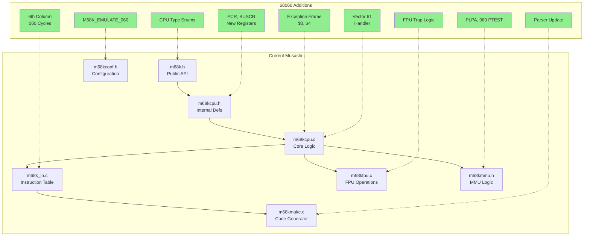

# 68060 Gap Analysis: Musashi Current State vs Requirements

> [!NOTE]
> **Post-Implementation (COMPLETE)**: All items below have been implemented and tested.
> `M68K_060_TRAP_UNIMPLEMENTED` flag was removed (real hardware always traps). FREM is software-emulated, not hardware.
> Integer traps (CAS2, CHK2/CMP2, 64-bit MULL/DIVL), FPU traps (FPIAR, packed decimal, FMOVECR, all transcendentals),
> PMMU instruction traps, and variant identification are all complete. See `walkthrough.md`.

## Executive Summary

Musashi currently supports 68000 through 68040 variants. Adding 68060 support requires:
- New CPU type definitions and configuration
- Instruction table extensions (6th column)
- Instruction trapping for unimplemented opcodes
- FPU instruction partitioning
- New exception frame formats
- New control registers (PCR, BUSCR)
- New instructions (PLPA, LPSTOP)

## Current Musashi Architecture

### Supported CPU Types

From `m68kcpu.h:180-190`:

```c
#define CPU_TYPE_000    (0x00000001)
#define CPU_TYPE_008    (0x00000002)
#define CPU_TYPE_010    (0x00000004)
#define CPU_TYPE_EC020  (0x00000008)
#define CPU_TYPE_020    (0x00000010)
#define CPU_TYPE_EC030  (0x00000020)
#define CPU_TYPE_030    (0x00000040)
#define CPU_TYPE_EC040  (0x00000080)
#define CPU_TYPE_LC040  (0x00000100)
#define CPU_TYPE_040    (0x00000200)
#define CPU_TYPE_SCC070 (0x00000400)
```

From `m68k.h:96-106`:

```c
typedef enum {
    M68K_CPU_TYPE_INVALID,
    M68K_CPU_TYPE_68000,
    M68K_CPU_TYPE_68010,
    M68K_CPU_TYPE_68EC020,
    M68K_CPU_TYPE_68020,
    M68K_CPU_TYPE_68EC030,
    M68K_CPU_TYPE_68030,
    M68K_CPU_TYPE_68EC040,
    M68K_CPU_TYPE_68LC040,
    M68K_CPU_TYPE_68040,
    M68K_CPU_TYPE_SCC68070
} m68k_cpu_type;
```

### Configuration Flags

From `m68kconf.h:67-85`:

```c
#define M68K_EMULATE_010    M68K_OPT_ON
#define M68K_EMULATE_EC020  M68K_OPT_ON
#define M68K_EMULATE_020    M68K_OPT_ON
#define M68K_EMULATE_030    M68K_OPT_ON
#define M68K_EMULATE_040    M68K_OPT_ON
// M68K_EMULATE_060 - MISSING
```

### Instruction Table Structure

From `m68k_in.c:378-380`:

```
              spec  spec                    allowed ea  mode       cpu cycles
name    size  proc   ea   bit pattern       A+-DXWLdxI  0 1 2 3 4  000 010 020 030 040
======  ====  ====  ====  ================  ==========  = = = = =  === === === === ===
```

**Gap**: Only 5 CPU columns exist. Need 6th column for 68060.

### Control Registers

Current registers in CPU state (from `m68kcpu.c`):
- SFC, DFC (Function Code registers)
- VBR (Vector Base Register)
- CACR (Cache Control Register) - 040 layout
- CAAR (Cache Address Register)
- USP, ISP, MSP (Stack Pointers)
- ITT0, ITT1, DTT0, DTT1 (Transparent Translation - 68040/68060 style)
- TC, URP, SRP (MMU registers - 68040/68060 use URP/SRP, NOT 68030's CRP)

**Gap**: Missing PCR and BUSCR for 68060.

**Note**: The 68030's CRP (CPU Root Pointer) with 64-bit descriptors is NOT used on 68040/68060. These processors use 32-bit URP (User Root Pointer) and SRP (Supervisor Root Pointer) directly.

### FPU Implementation

From `m68kfpu.c`: Full 68040-style FPU with all operations implemented including transcendentals.

**Gap**: No mechanism to trap operations as "unimplemented" based on CPU type.

### MMU Implementation

From `m68kmmu.h:1-8`:

```c
/*
    m68kmmu.h - PMMU implementation for 68851/68030/68040
*/
```

**Gap**: 
- No 68060 PTEST semantics
- No PLPA instruction
- No EC060 "MMU disabled" path

### Exception Handling

Current exception cycle table has 5 entries (from `m68kcpu.c:137`):

```c
const uint8 m68ki_exception_cycle_table[5][256]
```

**Gap**: 
- Need 6th entry for 68060
- No frame format $0 (4-word) or $4 (8-word access fault) generation
- No vector 61 (unimplemented integer) handling

## Detailed Gap Analysis

### Gap 1: CPU Type Infrastructure

| Item | Current | Required | Location |
|------|---------|----------|----------|
| CPU_TYPE_060 | Missing | Add | m68kcpu.h |
| CPU_TYPE_EC060 | Missing | Add | m68kcpu.h |
| CPU_TYPE_LC060 | Missing | Add | m68kcpu.h |
| M68K_CPU_TYPE_68060 | Missing | Add | m68k.h |
| M68K_EMULATE_060 | Missing | Add | m68kconf.h |
| m68k_set_cpu_type case | Missing | Add | m68kcpu.c |

### Gap 2: Instruction Table

| Item | Current | Required | Location |
|------|---------|----------|----------|
| NUM_CPU_TYPES | 5 | 6 | m68k_in.c, m68kmake.c |
| Cycle columns | 000-040 | 000-060 | m68k_in.c |
| Parser columns | 5 | 6 | m68kmake.c |

### Gap 3: Trapped Instructions

Instructions that must trap on 68060:

**Integer Instructions -> Vector 61:**

| Instruction | Current Behavior | Required | Vector |
|-------------|-----------------|----------|--------|
| MOVEP | Executes | Trap | 61 |
| CAS2 | Executes | Trap | 61 |
| CHK2/CMP2 | Executes | Trap | 61 |
| MULS.L 64-bit | Executes | Trap | 61 |
| MULU.L 64-bit | Executes | Trap | 61 |
| DIVS.L 64-bit | Executes | Trap | 61 |
| DIVU.L 64-bit | Executes | Trap | 61 |

**FPU Instructions -> Vector 11:**

| Instruction | Current Behavior | Required | Vector |
|-------------|-----------------|----------|--------|
| FSIN, FCOS, etc. | Executes | Trap | 11 |
| FMOVECR (ALL offsets) | Executes | Trap | 11 |
| FPIAR access (FMOVE/FMOVEM) | Executes | Trap | 11 |
| Packed decimal FMOVE | Executes | Trap | 11 |

**Critical**: FMOVECR is fully unimplemented on 68060 (no constant ROM). FPIAR register was eliminated from hardware entirely.

### Gap 4: Control Registers

| Register | Current | Required | MOVEC Code |
|----------|---------|----------|------------|
| PCR | Missing | Add | $808 |
| BUSCR | Missing | Add | $008 |
| CACR | 040 layout | 060 layout | $002 |

### Gap 5: Exception Frames

| Format | Current | Required |
|--------|---------|----------|
| $0 (4-word) | Missing | Add for 68060 |
| $4 (8-word access) | Missing | Add for 68060 |
| RTE decoding | 040 formats | Add 060 formats |

### Gap 6: New Instructions

| Instruction | Current | Required |
|-------------|---------|----------|
| PLPA | Missing | Implement |
| LPSTOP | Missing | Implement |

## Architecture Diagram



## Compatibility Considerations

### MAME Fork

MAME's `src/devices/cpu/m68000/` contains partial 68060 work:
- Some stack frame handling
- PCR register
- Partial instruction handling

**License Issue**: MAME is GPL-2.0, Musashi is MIT. Direct code copying would require license change. Recommend clean-room reimplementation using Motorola documentation.

### Behavioral Accuracy vs Performance

| Approach | Accuracy | Performance | Use Case |
|----------|----------|-------------|----------|
| Trap all unimplemented | High | Depends on guest ISP/FPSP | OS with 68060.library |
| Native fallback | Lower | Better | Systems without ISP/FPSP |

Recommendation: Implement both behind `M68K_060_TRAP_UNIMPLEMENTED` flag.

## Effort Estimates

| Component | Complexity | Estimated Days |
|-----------|------------|----------------|
| Infrastructure (types, config) | Low | 2-3 |
| Instruction table | Medium | 3-4 |
| Integer trapping | Medium | 2-3 |
| FPU partitioning | High | 3-4 |
| Exception frames | Medium | 2-3 |
| New instructions | Low | 1-2 |
| MMU adjustments | Medium | 2-3 |
| Testing | High | 5-10 |

**Total**: 20-32 days (4-6 weeks)
