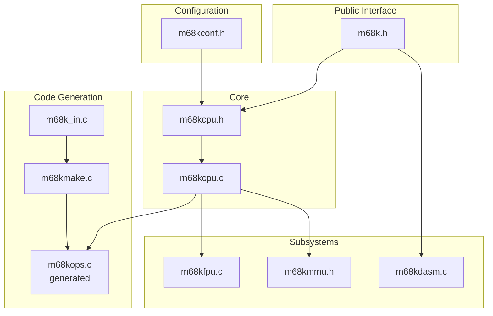
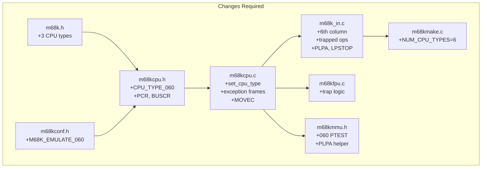
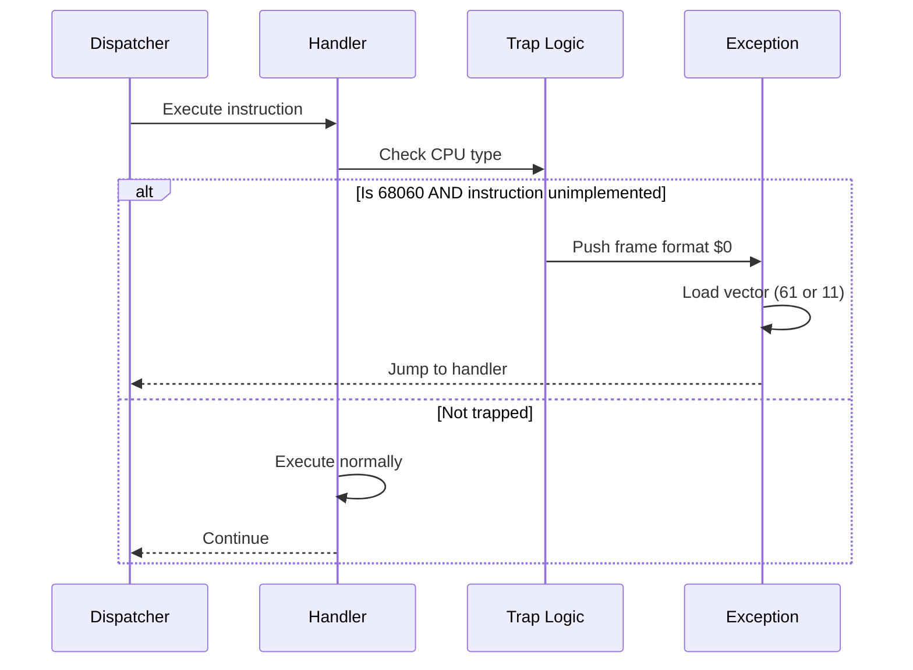

# Technical Design Document: Motorola 68060 Support for Musashi

## Document Information

| Item | Value |
|------|-------|
| Version | 1.1 |
| Status | Implemented |
| Target | Musashi v4.10+ |

> [!IMPORTANT]
> **Revision Notes (v1.1)**:
> - `M68K_060_TRAP_UNIMPLEMENTED` flag was **removed** during implementation. Real 68060 hardware always traps unimplemented instructions — there is no opt-out mode. Trap behavior is now unconditional via `CPU_TYPE_IS_060_PLUS()` runtime checks.
> - `FREM` (opmode 0x25) is **NOT** hardware-implemented on the 68060 (confirmed via MC68060UM). It was incorrectly listed as a hardware op in the original draft. FREM traps to Vector 11 for FPSP emulation.
> - Code snippets below showing `#if M68K_060_TRAP_UNIMPLEMENTED` guards reflect the original design; the actual implementation omits these preprocessor guards.


## Table of Contents

1. [Introduction](#1-introduction)
2. [System Architecture](#2-system-architecture)
3. [Detailed Design](#3-detailed-design)
4. [File-by-File Changes](#4-file-by-file-changes)
5. [Data Structures](#5-data-structures)
6. [Algorithms](#6-algorithms)
7. [API Changes](#7-api-changes)
8. [Testing Strategy](#8-testing-strategy)

---

## 1. Introduction

### 1.1 Purpose

This document specifies the technical design for adding Motorola 68060 CPU emulation to the Musashi M68000 emulator. It details all code changes, new data structures, and algorithms required.

### 1.2 Scope

- MC68060 (full implementation)
- MC68LC060 (no FPU)
- MC68EC060 (no FPU, no MMU)

### 1.3 Design Principles

1. **Minimal invasion**: Follow existing Musashi patterns
2. **Backward compatibility**: No changes to existing CPU behavior
3. **Configurability**: Compile-time and runtime options
4. **Accuracy over performance**: Correct behavior first, optimize later

---

## 2. System Architecture

### 2.1 Current Architecture



### 2.2 68060 Integration Points



---

## 3. Detailed Design

### 3.1 CPU Type System

#### 3.1.1 Type Bitmasks

The CPU type system uses bitmasks for efficient type checking. New values continue the pattern:

```c
// m68kcpu.h - line ~191 (after CPU_TYPE_SCC070)
#define CPU_TYPE_EC060  (0x00000800)
#define CPU_TYPE_LC060  (0x00001000)  
#define CPU_TYPE_060    (0x00002000)

// Convenience macros
#define CPU_TYPE_IS_060_PLUS()  (CPU_TYPE & (CPU_TYPE_EC060 | CPU_TYPE_LC060 | CPU_TYPE_060))
#define CPU_TYPE_IS_060()       (CPU_TYPE & CPU_TYPE_060)
#define CPU_TYPE_IS_LC060()     (CPU_TYPE & CPU_TYPE_LC060)
#define CPU_TYPE_IS_EC060()     (CPU_TYPE & CPU_TYPE_EC060)
```

#### 3.1.1a Existing `_PLUS` Macro Updates (CRITICAL)

> **CRITICAL**: All existing `CPU_TYPE_IS_*_PLUS()` macros in `m68kcpu.h` are hardcoded bitmask ORs. They **must** be extended to include the new 060 type bitmasks, or the 68060 will fail every "is this a 020+ CPU?" check and behave like a 68000.

```c
// m68kcpu.h lines ~409-449: EVERY _PLUS macro must include 060 types.
// Only the MODIFIED versions are shown below:

#define CPU_TYPE_IS_040_PLUS(A)    ((A) & (CPU_TYPE_040 | CPU_TYPE_EC040 | CPU_TYPE_LC040 | \
                                           CPU_TYPE_EC060 | CPU_TYPE_LC060 | CPU_TYPE_060))

#define CPU_TYPE_IS_030_PLUS(A)    ((A) & (CPU_TYPE_030 | CPU_TYPE_EC030 | \
                                           CPU_TYPE_040 | CPU_TYPE_EC040 | CPU_TYPE_LC040 | \
                                           CPU_TYPE_EC060 | CPU_TYPE_LC060 | CPU_TYPE_060))

#define CPU_TYPE_IS_020_PLUS(A)    ((A) & (CPU_TYPE_020 | CPU_TYPE_030 | CPU_TYPE_EC030 | \
                                           CPU_TYPE_040 | CPU_TYPE_EC040 | CPU_TYPE_LC040 | \
                                           CPU_TYPE_EC060 | CPU_TYPE_LC060 | CPU_TYPE_060))

#define CPU_TYPE_IS_EC020_PLUS(A)  ((A) & (CPU_TYPE_EC020 | CPU_TYPE_020 | \
                                           CPU_TYPE_030 | CPU_TYPE_EC030 | \
                                           CPU_TYPE_040 | CPU_TYPE_EC040 | CPU_TYPE_LC040 | \
                                           CPU_TYPE_EC060 | CPU_TYPE_LC060 | CPU_TYPE_060))

#define CPU_TYPE_IS_010_PLUS(A)    ((A) & (CPU_TYPE_010 | CPU_TYPE_EC020 | CPU_TYPE_020 | \
                                           CPU_TYPE_EC030 | CPU_TYPE_030 | \
                                           CPU_TYPE_040 | CPU_TYPE_EC040 | CPU_TYPE_LC040 | \
                                           CPU_TYPE_EC060 | CPU_TYPE_LC060 | CPU_TYPE_060))
```

> **NOTE**: `CPU_TYPE_LC040` is currently missing from the existing `_PLUS` macros in the Musashi source. This is an existing bug that must be fixed simultaneously.

#### 3.1.2 Type Enumeration

```c
// m68k.h - m68k_cpu_type enum (after M68K_CPU_TYPE_SCC68070)
M68K_CPU_TYPE_68EC060,
M68K_CPU_TYPE_68LC060,
M68K_CPU_TYPE_68060
```

### 3.2 Control Register Design

#### 3.2.1 PCR (Processor Configuration Register)

```c
// m68kcpu.h - CPU state structure
uint32 pcr;  // Processor Configuration Register

// PCR bit definitions
#define PCR_REVISION_MASK  0xFFFF0000
#define PCR_ESS            0x00008000  // Enable Superscalar
#define PCR_DFP            0x00004000  // Disable FPU
#define PCR_EBE            0x00000080  // Enable Branch cache Entry
#define PCR_BTB            0x00000010  // Branch Target Buffer
#define PCR_NAD            0x00000004  // No Align Down
#define PCR_ESL            0x00000002  // Enable Store Location  
#define PCR_EPE            0x00000001  // Enable Pipelined Exceptions

// PCR ID values (upper 16 bits, read-only)
#define PCR_ID_68060    0x04300000
#define PCR_ID_68LC060  0x04310000
#define PCR_ID_68EC060  0x04320000
```

#### 3.2.2 BUSCR (Bus Control Register)

```c
// m68kcpu.h - CPU state structure
uint32 buscr;  // Bus Control Register (largely stubbed)
```

#### 3.2.3 MOVEC Register Codes

```c
// Control register codes for MOVEC
#define CR_BUSCR  0x008
#define CR_PCR    0x808
```

### 3.3 Exception Frame Design

#### 3.3.1 Frame Format Constants

```c
// m68kcpu.h
#define FRAME_FORMAT_0  0x0000  // 68060 4-word normal
#define FRAME_FORMAT_4  0x4000  // 68060 8-word access fault
```

#### 3.3.2 Frame Pushing Functions

```c
// m68kcpu.c

// 68060 Format $0: 4-word normal frame
static void m68ki_push_frame_060_normal(uint vector)
{
    uint format_vector = FRAME_FORMAT_0 | (vector << 2);
    m68ki_push_16(format_vector);
    m68ki_push_32(REG_PC);
    m68ki_push_16(m68ki_get_sr());
}

// 68060 Format $4: 8-word access fault frame
static void m68ki_push_frame_060_access(uint vector, uint fault_addr, uint fault_status)
{
    uint format_vector = FRAME_FORMAT_4 | (vector << 2);
    m68ki_push_32(fault_status);
    m68ki_push_32(fault_addr);
    m68ki_push_16(format_vector);
    m68ki_push_32(REG_PC);
    m68ki_push_16(m68ki_get_sr());
}
```

### 3.4 Instruction Trapping Design

#### 3.4.1 Trap Mechanism



#### 3.4.2 Integer Trap Handler

```c
// m68kcpu.h
#define EXCEPTION_UNIMPLEMENTED_INTEGER  61

// m68kcpu.c
static void m68ki_exception_unimplemented_integer(void)
{
    uint sr = m68ki_init_exception();
    m68ki_push_frame_060_normal(EXCEPTION_UNIMPLEMENTED_INTEGER);
    m68ki_jump_vector(EXCEPTION_UNIMPLEMENTED_INTEGER);
    USE_CYCLES(CYC_EXCEPTION[EXCEPTION_UNIMPLEMENTED_INTEGER] - CYC_INSTRUCTION[REG_IR]);
}
```

#### 3.4.3 FPU Trap Integration

```c
// m68kfpu.c

// Bitmap of operations implemented in 68060 hardware
static const uint64 FPU_060_HARDWARE_OPS = 
    (1ULL << 0x00) |  // FMOVE
    (1ULL << 0x01) |  // FINT
    (1ULL << 0x03) |  // FINTRZ
    (1ULL << 0x04) |  // FSQRT
    (1ULL << 0x18) |  // FABS
    (1ULL << 0x1A) |  // FNEG
    (1ULL << 0x20) |  // FDIV
    (1ULL << 0x22) |  // FADD
    (1ULL << 0x23) |  // FMUL
    (1ULL << 0x28) |  // FSUB
    (1ULL << 0x38) |  // FCMP
    (1ULL << 0x3A);   // FTST

static inline int fpu_op_in_060_hardware(uint opcode)
{
    return (FPU_060_HARDWARE_OPS >> (opcode & 0x3F)) & 1;
}
```

### 3.5 Instruction Table Design

#### 3.5.1 Column Extension

Current format (5 CPU types):
```
name    size  proc   ea   bit pattern       A+-DXWLdxI  0 1 2 3 4  000 010 020 030 040
```

New format (6 CPU types):
```
name    size  proc   ea   bit pattern       A+-DXWLdxI  0 1 2 3 4 5  000 010 020 030 040 060
```

#### 3.5.2 Trapped Instruction Markers

Convention for 68060 column:
- Numeric value: cycle count, instruction executes
- `T`: Traps to vector 61 (unimplemented integer)
- `F`: Traps to vector 11 (F-line/FPU)
- `.`: Instruction not available on this CPU

#### 3.5.3 Example Table Entries

```
// Currently:
movep     16  er    .     0000...100001...  ..........  U U U U U  16  16  12  12  12

// After modification:
movep     16  er    .     0000...100001...  ..........  U U U U U T  16  16  12  12  12  T

// cas2 (already 020+):  
cas2      16  .     .     0000110011111100  ..........  . . U U U T   .   .  12  12  12  T
```

---

## 4. File-by-File Changes

### 4.1 m68k.h

**Location**: Root directory  
**Purpose**: Public API header

#### Changes Required

| Line | Change Type | Description |
|------|-------------|-------------|
| ~106 | Add | M68K_CPU_TYPE_68EC060 to enum |
| ~107 | Add | M68K_CPU_TYPE_68LC060 to enum |
| ~108 | Add | M68K_CPU_TYPE_68060 to enum |
| ~151 | Add | M68K_REG_PCR to m68k_register_t |
| ~152 | Add | M68K_REG_BUSCR to m68k_register_t |

```c
// After line 105 (M68K_CPU_TYPE_SCC68070)
M68K_CPU_TYPE_68EC060,
M68K_CPU_TYPE_68LC060,
M68K_CPU_TYPE_68060

// In m68k_register_t enum
M68K_REG_PCR,
M68K_REG_BUSCR,
```

---

### 4.2 m68kconf.h

**Location**: Root directory  
**Purpose**: Compile-time configuration

#### Changes Required

| Line | Change Type | Description |
|------|-------------|-------------|
| ~86 | Add | M68K_EMULATE_060 flag |
| ~87 | Add | M68K_060_TRAP_UNIMPLEMENTED flag |

```c
// After M68K_EMULATE_040 (line ~84)
#ifndef M68K_EMULATE_060
#define M68K_EMULATE_060            M68K_OPT_ON
#endif

// New configuration option
#ifndef M68K_060_TRAP_UNIMPLEMENTED  
#define M68K_060_TRAP_UNIMPLEMENTED M68K_OPT_ON
#endif
```

---

### 4.3 m68kcpu.h

**Location**: Root directory  
**Purpose**: Internal CPU definitions

#### Changes Required

| Line | Change Type | Description |
|------|-------------|-------------|
| ~190 | Add | CPU_TYPE_EC060, CPU_TYPE_LC060, CPU_TYPE_060 |
| ~191 | Add | CPU type checking macros |
| ~170 | Add | EXCEPTION_UNIMPLEMENTED_INTEGER constant |
| CPU struct | Add | pcr, buscr, has_fpu fields |
| Macros | Add | REG_PCR, REG_BUSCR, HAS_FPU accessors |
| ~409-449 | Modify | Update ALL `_PLUS` macros to include 060 types (see §3.1.1a) |

```c
// Line ~190: CPU type bitmasks
#define CPU_TYPE_EC060  (0x00000800)
#define CPU_TYPE_LC060  (0x00001000)
#define CPU_TYPE_060    (0x00002000)

// Line ~191: Convenience macros
#define CPU_TYPE_IS_060_PLUS()  (CPU_TYPE & (CPU_TYPE_EC060|CPU_TYPE_LC060|CPU_TYPE_060))
#define CPU_TYPE_IS_060_ONLY()  (CPU_TYPE & CPU_TYPE_060)
#define CPU_TYPE_IS_060_FAMILY() CPU_TYPE_IS_060_PLUS()

// Line ~170: Exception vector
#define EXCEPTION_UNIMPLEMENTED_INTEGER 61

// In m68ki_cpu_core structure (around line ~978, append after existing fields)
uint32 pcr;       /* Processor Configuration Register (68060) */
uint32 buscr;     /* Bus Control Register (68060) */
int    has_fpu;   /* Indicates if an FPU is available (0 for LC040, EC040, LC060, EC060) */

// Register accessor macros
#define REG_PCR    m68ki_cpu.pcr
#define REG_BUSCR  m68ki_cpu.buscr
#define HAS_FPU    m68ki_cpu.has_fpu
```

> **CRITICAL**: The `has_fpu` field is essential for LC060 (no FPU) and EC060 (no FPU, no MMU). Without it, FPU instructions would execute natively on FPU-less variants. The existing `has_pmmu` field is the precedent for this pattern.

##### has_fpu Initialization for ALL CPU Types

The new `has_fpu` field must be initialized in `m68k_set_cpu_type()` for **every** existing CPU type to maintain backward compatibility:

| CPU Type | `has_fpu` Value | Rationale |
|----------|----------------|----------|
| 68000 | 0 | No FPU hardware |
| 68010 | 0 | No FPU hardware |
| 68EC020 | 0 | Coprocessor interface only (external 68881/2) |
| 68020 | 0 | Coprocessor interface only (external 68881/2) |
| 68EC030 | 0 | Coprocessor interface only |
| 68030 | 0 | Coprocessor interface only |
| 68EC040 | 0 | Stripped FPU variant |
| 68LC040 | 0 | Stripped FPU variant |
| 68040 | 1 | Integrated FPU |
| 68EC060 | 0 | No FPU, no MMU |
| 68LC060 | 0 | No FPU |
| 68060 | 1 | Integrated FPU |

---

### 4.4 m68kcpu.c

**Location**: Root directory  
**Purpose**: Core CPU implementation

#### Changes Required

| Location | Change Type | Description |
|----------|-------------|-------------|
| m68ki_exception_cycle_table | Extend | Add 6th entry for 68060 |
| m68k_get_reg | Extend | Handle PCR, BUSCR |
| m68k_set_reg | Extend | Handle PCR, BUSCR |
| m68k_set_cpu_type | Add | Cases for 060/LC060/EC060 |
| MOVEC handler | Extend | Add PCR ($808), BUSCR ($008), trap MMUSR ($805) |
| New functions | Add | Exception frame functions |

##### Exception Cycle Table Extension

```c
// Line ~137: Extend from [5] to [6]
const uint8 m68ki_exception_cycle_table[6][256] =
{
    { /* 000 */ ... },  /* Index [0] — unchanged */
    { /* 010 */ ... },  /* Index [1] — unchanged */
    { /* 020 */ ... },  /* Index [2] — unchanged */
    { /* 030 */ ... },  /* Index [3] — unchanged */
    { /* 040 */ ... },  /* Index [4] — unchanged */
    { /* 060 — new entry [5] */
         4, /*  0: Reset - Initial Stack Pointer                      */
         4, /*  1: Reset - Initial Program Counter                    */
        46, /*  2: Bus Error (format $4 frame)                        */
        46, /*  3: Address Error (format $4 frame)                    */
         4, /*  4: Illegal Instruction                                */
        16, /*  5: Divide by Zero                                     */
        16, /*  6: CHK                                                */
         4, /*  7: TRAPV                                              */
         4, /*  8: Privilege Violation                                */
         4, /*  9: Trace                                              */
         4, /* 10: 1010 (A-line)                                      */
         4, /* 11: 1111 (F-line / FPU unimplemented)                  */
         4, /* 12: RESERVED                                           */
         4, /* 13: Coprocessor Protocol Violation                     */
         4, /* 14: Format Error                                       */
         4, /* 15: Uninitialized Interrupt                            */
         4,4,4,4,4,4,4,4,    /* 16-23: RESERVED                      */
        24, /* 24: Spurious Interrupt                                 */
        24, /* 25: Level 1 Interrupt Autovector                       */
        24, /* 26: Level 2 Interrupt Autovector                       */
        24, /* 27: Level 3 Interrupt Autovector                       */
        24, /* 28: Level 4 Interrupt Autovector                       */
        24, /* 29: Level 5 Interrupt Autovector                       */
        24, /* 30: Level 6 Interrupt Autovector                       */
        24, /* 31: Level 7 Interrupt Autovector                       */
         4, /* 32: TRAP #0                                            */
         4, /* 33: TRAP #1                                            */
         4, /* 34: TRAP #2                                            */
         4, /* 35: TRAP #3                                            */
         4, /* 36: TRAP #4                                            */
         4, /* 37: TRAP #5                                            */
         4, /* 38: TRAP #6                                            */
         4, /* 39: TRAP #7                                            */
         4, /* 40: TRAP #8                                            */
         4, /* 41: TRAP #9                                            */
         4, /* 42: TRAP #10                                           */
         4, /* 43: TRAP #11                                           */
         4, /* 44: TRAP #12                                           */
         4, /* 45: TRAP #13                                           */
         4, /* 46: TRAP #14                                           */
         4, /* 47: TRAP #15                                           */
         4, /* 48: FP Branch on Unordered                             */
         4, /* 49: FP Inexact Result                                  */
         4, /* 50: FP Divide by Zero                                  */
         4, /* 51: FP Underflow                                       */
         4, /* 52: FP Operand Error                                   */
         4, /* 53: FP Overflow                                        */
         4, /* 54: FP Signaling NAN                                   */
         4, /* 55: FP Unimplemented Data Type                         */
         4, /* 56: MMU Configuration Error (not used on 060)          */
         4, /* 57: MMU Illegal Operation (not used on 060)            */
         4, /* 58: MMU Access Level Violation (not used on 060)       */
         4, /* 59: RESERVED                                           */
         4, /* 60: Unimplemented FP Instruction (FPSP entry)          */
         4, /* 61: Unimplemented Integer Instruction (ISP entry)      */
         4, /* 62: RESERVED                                           */
         4, /* 63: RESERVED                                           */
            /* 64-255: User Defined                                   */
         4,4,4,4,4,4,4,4,4,4,4,4,4,4,4,4,4,4,4,4,4,4,4,4,4,4,4,4,4,4,4,4,
         4,4,4,4,4,4,4,4,4,4,4,4,4,4,4,4,4,4,4,4,4,4,4,4,4,4,4,4,4,4,4,4,
         4,4,4,4,4,4,4,4,4,4,4,4,4,4,4,4,4,4,4,4,4,4,4,4,4,4,4,4,4,4,4,4,
         4,4,4,4,4,4,4,4,4,4,4,4,4,4,4,4,4,4,4,4,4,4,4,4,4,4,4,4,4,4,4,4,
         4,4,4,4,4,4,4,4,4,4,4,4,4,4,4,4,4,4,4,4,4,4,4,4,4,4,4,4,4,4,4,4,
         4,4,4,4,4,4,4,4,4,4,4,4,4,4,4,4,4,4,4,4,4,4,4,4,4,4,4,4,4,4,4,4
    }
};
```

##### CPU Type Initialization

```c
// In m68k_set_cpu_type(), after M68K_CPU_TYPE_68040 case (~line 903)

case M68K_CPU_TYPE_68EC060:
    CPU_TYPE         = CPU_TYPE_EC060;
    CPU_ADDRESS_MASK = 0xffffffff;
    CPU_SR_MASK      = 0xf71f;
    CYC_INSTRUCTION  = m68ki_cycles[5];
    CYC_EXCEPTION    = m68ki_exception_cycle_table[5];
    CYC_BCC_NOTAKE_B = -2;
    CYC_BCC_NOTAKE_W = 0;
    CYC_DBCC_F_NOEXP = 0;
    CYC_DBCC_F_EXP   = 4;
    CYC_SCC_R_TRUE   = 0;
    CYC_MOVEM_W      = 2;
    CYC_MOVEM_L      = 2;
    CYC_SHIFT        = 0;
    CYC_RESET        = 518;
    HAS_PMMU         = 0;  /* EC060 has no MMU */
    HAS_FPU          = 0;  /* EC060 has no FPU */
    REG_PCR          = PCR_ID_68EC060 | PCR_DFP;
    REG_BUSCR        = 0;
    return;

case M68K_CPU_TYPE_68LC060:
    CPU_TYPE         = CPU_TYPE_LC060;
    CPU_ADDRESS_MASK = 0xffffffff;
    CPU_SR_MASK      = 0xf71f;
    CYC_INSTRUCTION  = m68ki_cycles[5];
    CYC_EXCEPTION    = m68ki_exception_cycle_table[5];
    // ... same as above ...
    HAS_PMMU         = M68K_EMULATE_PMMU;
    HAS_FPU          = 0;  /* LC060 has no FPU */
    REG_PCR          = PCR_ID_68LC060 | PCR_DFP;
    REG_BUSCR        = 0;
    return;

case M68K_CPU_TYPE_68060:
    CPU_TYPE         = CPU_TYPE_060;
    CPU_ADDRESS_MASK = 0xffffffff;
    CPU_SR_MASK      = 0xf71f;
    CYC_INSTRUCTION  = m68ki_cycles[5];
    CYC_EXCEPTION    = m68ki_exception_cycle_table[5];
    // ... same as above ...
    HAS_PMMU         = M68K_EMULATE_PMMU;
    HAS_FPU          = M68K_EMULATE_060;
    REG_PCR          = PCR_ID_68060;
    REG_BUSCR        = 0;
    return;
```

##### Register Accessors

```c
// In m68k_get_reg() switch statement
case M68K_REG_PCR:   return cpu->pcr;
case M68K_REG_BUSCR: return cpu->buscr;

// In m68k_get_reg() — extend M68K_REG_CPU_TYPE case (currently missing 060)
case M68K_REG_CPU_TYPE:
    switch(cpu->cpu_type)
    {
        // ... existing cases ...
        case CPU_TYPE_EC060:  return (unsigned int)M68K_CPU_TYPE_68EC060;
        case CPU_TYPE_LC060:  return (unsigned int)M68K_CPU_TYPE_68LC060;
        case CPU_TYPE_060:    return (unsigned int)M68K_CPU_TYPE_68060;
    }
    return M68K_CPU_TYPE_INVALID;

// In m68k_set_reg() switch statement  
case M68K_REG_PCR:
    // Only writable bits, preserve ID
    cpu->pcr = (cpu->pcr & 0xFFFF0000) | (value & 0x0000FFFF);
    return;
case M68K_REG_BUSCR:
    cpu->buscr = value;
    return;
```

##### CPU Log Names Update

```c
// In m68ki_cpu_names[] array (m68kcpu.c, line ~64)
// Add after "SCC68070" entry:
"M68EC060",
"M68LC060",
"M68060",
```

##### New Exception Functions

```c
// Add after existing exception functions

/* 68060 Unimplemented Integer Instruction Exception (Vector 61) */
static inline void m68ki_exception_unimplemented_integer(void)
{
    uint sr;

    sr = m68ki_init_exception();

    /* 
     * Reuse existing m68ki_stack_frame_0000() which already pushes
     * Format $0 (4-word frame) for 010+ CPUs:
     *   push format/vector word, push PC, push SR
     *
     * NOTE: We pass REG_PPC (Previous PC = start of the trapping
     * instruction) so the ISP handler can decode the instruction.
     */
    m68ki_stack_frame_0000(REG_PPC, sr, EXCEPTION_UNIMPLEMENTED_INTEGER);
    m68ki_jump_vector(EXCEPTION_UNIMPLEMENTED_INTEGER);

    USE_CYCLES(CYC_EXCEPTION[EXCEPTION_UNIMPLEMENTED_INTEGER]);
}

/* 68060 8-word access fault frame (format $4) */  
static inline void m68ki_stack_frame_4(uint vector, uint fault_addr, uint status)
{
    /* 
     * Fault Status Long Word (FSLW) definition:
     * Bit 27: TM - Translation Missing
     * Bit 26: BA - Bus Address Error
     * Bit 24: MA - Misaligned Access
     * Bit 23: WP - Write Protection
     * Bit 21: WE - Write Error
     * Bit 20: RE - Read Error
     * Bit 17: W  - Read/Write
     * Bits 2-0: SIZE - Fault Size
     */
    m68ki_push_32(status);
    /* Fault address */
    m68ki_push_32(fault_addr);
    /* Format word: format=$4, vector offset */
    m68ki_push_16((4 << 12) | (vector << 2));
    /* Program counter */
    m68ki_push_32(REG_PPC);
    /* Status register */
    m68ki_push_16(m68ki_get_sr());
}
```

---

### 4.5 m68k_in.c

**Location**: Root directory  
**Purpose**: Instruction definitions and handlers

#### Changes Required

| Location | Change Type | Description |
|----------|-------------|-------------|
| Table header (~379) | Modify | Add 060 column header |
| Table entries | Modify | Add 6th column to all entries |
| Trapped instructions | Modify | Mark with T/F for 060 |
| 040fpu0/040fpu1 | Modify | Add `HAS_FPU` guard (see below) |
| RTE handler | Extend | Handle 060 frame formats |
| New handlers | Add | PLPA, LPSTOP |

##### FPU Entry Point Guard (CRITICAL)

The existing `040fpu0` and `040fpu1` handlers only check `CPU_TYPE_IS_030_PLUS()` before calling the FPU. There is **no guard for FPU-less variants** (LC040, EC040, LC060, EC060). This must be added:

```c
// m68k_in.c, line ~918
M68KMAKE_OP(040fpu0, 32, ., .)
{
    if(CPU_TYPE_IS_030_PLUS(CPU_TYPE))
    {
        /* NEW: Guard for FPU-less variants (LC040, EC040, LC060, EC060) */
        if (!HAS_FPU) {
            m68ki_exception_1111();    /* F-line trap — no FPU present */
            return;
        }
        m68040_fpu_op0();
        return;
    }
    m68ki_exception_1111();
}

// m68k_in.c, line ~929
M68KMAKE_OP(040fpu1, 32, ., .)
{
    if(CPU_TYPE_IS_030_PLUS(CPU_TYPE))
    {
        if (!HAS_FPU) {
            m68ki_exception_1111();
            return;
        }
        m68040_fpu_op1();
        return;
    }
    m68ki_exception_1111();
}
```

> **NOTE**: This also retroactively fixes a pre-existing bug where LC040 and EC040 variants would incorrectly execute FPU instructions instead of trapping.

##### Table Header Modification

```
// Line ~378-380: Change from
              spec  spec                    allowed ea  mode       cpu cycles
name    size  proc   ea   bit pattern       A+-DXWLdxI  0 1 2 3 4  000 010 020 030 040

// To
              spec  spec                    allowed ea  mode         cpu cycles
name    size  proc   ea   bit pattern       A+-DXWLdxI  0 1 2 3 4 5  000 010 020 030 040 060
```

##### Example Entry Modifications

```
// MOVEP - traps on 060 (vector 61)
movep     16  er    .     0000...100001...  ..........  U U U U U T  16  16  12  12  12   T
movep     32  er    .     0000...101001...  ..........  U U U U U T  24  24  18  18  18   T
movep     16  re    .     0000...110001...  ..........  U U U U U T  16  16  11  11  11   T
movep     32  re    .     0000...111001...  ..........  U U U U U T  24  24  17  17  17   T

// CAS2 - traps on 060 (vector 61)  
cas2      16  .     .     0000110011111100  ..........  . . U U U T   .   .  12  12  12   T
cas2      32  .     .     0000111011111100  ..........  . . U U U T   .   .  12  12  12   T

// CHK2/CMP2 - traps on 060 (vector 61)
chk2cmp2   8  .     .     0000000011......  A..DXWL...  . . U U U T   .   .  18  18  18   T

// MULL 64-bit - traps on 060; 32-bit result version stays
mull      32  .     d     0100110000000...  ..........  . . U U U U   .   .  43  43  43   2
// Note: handler must check if 64-bit result requested and trap if 060

// Standard instruction - works on 060
add        8  er    d     1101...000000...  ..........  U U U U U U   4   4   2   2   2   1
```

##### New Instruction Handlers

```c
// PLPA - Physical Load Physical Address (68060 only)
// Opcode: 1111 0101 00xx x000
M68KMAKE_OP(plpa, 32, ., .)
{
    if (!CPU_TYPE_IS_060_PLUS()) {
        m68ki_exception_illegal();
        return;
    }
    
    if (!(FLAG_S)) {
        m68ki_exception_privilege_violation();
        return;
    }
    
    /* Get effective address from An */
    uint ea = AY;
    
    /* Probe MMU for physical address */
    /* For EC060, this is effectively a NOP as there's no MMU */
    if (HAS_PMMU) {
        /* Translation happens here - implementation in m68kmmu.h */
        uint pa = pmmu_translate_addr_060_plpa(ea);
        AY = pa;  /* Result stored back in register */
    }
    /* If no MMU, address passes through unchanged */
}

// LPSTOP - Low Power Stop (68060 only)
// Opcode: 1111 1000 0000 0000, extension word: 0000 0001 1100 0000
M68KMAKE_OP(lpstop, 0, ., .)
{
    if (!CPU_TYPE_IS_060_PLUS()) {
        m68ki_exception_illegal();
        return;
    }
    
    if (!(FLAG_S)) {
        m68ki_exception_privilege_violation();
        return;
    }
    
    uint ext = OPER_I_16();
    if (ext != 0x01C0) {
        m68ki_exception_illegal();
        return;
    }
    
    uint new_sr = OPER_I_16();
    m68ki_set_sr_noint(new_sr);
    CPU_STOPPED |= STOP_LEVEL_STOP;
    m68ki_remaining_cycles = 0;
    
#if M68K_EMULATE_LPSTOP_CALLBACK
    M68K_LPSTOP_CALLBACK();
#endif
}
```

##### RTE Handler Extension

```c
// In M68KMAKE_OP(rte, 32, ., .)
// Add case for format $0 (68060 4-word frame)

case 0x0:  /* Format $0 - 68060 4-word normal frame */
    if (CPU_TYPE_IS_060_PLUS()) {
        new_sr = m68ki_pull_16();
        new_pc = m68ki_pull_32();
        m68ki_pull_16();  /* format/vector word already read */
        m68ki_jump(new_pc);
        m68ki_set_sr(new_sr);
        CPU_INSTR_MODE = INSTRUCTION_YES;
        CPU_RUN_MODE = RUN_MODE_NORMAL;
        return;
    }
    /* Fall through to format error for other CPUs */
    break;

case 0x4:  /* Format $4 - 68060 8-word access fault frame */
    if (CPU_TYPE_IS_060_PLUS()) {
        new_sr = m68ki_pull_16();
        new_pc = m68ki_pull_32();
        m68ki_pull_16();  /* format/vector */
        m68ki_pull_32();  /* effective address - discard */
        m68ki_pull_32();  /* fault status - discard */
        m68ki_jump(new_pc);
        m68ki_set_sr(new_sr);
        CPU_INSTR_MODE = INSTRUCTION_YES;
        CPU_RUN_MODE = RUN_MODE_NORMAL;
        return;
    }
    break;
```

---

### 4.6 m68kmake.c

**Location**: Root directory  
**Purpose**: Instruction table code generator

#### Changes Required

| Location | Change Type | Description |
|----------|-------------|-------------|
| NUM_CPU_TYPES | Change | 5 -> 6 |
| Cycle parsing | Extend | Read 6 columns |
| Table generation | Extend | Generate 6-element arrays |
| Trap marker handling | Add | Handle 'T' and 'F' markers |

```c
// Line ~142: Change constant
enum {
    CPU_TYPE_000=0,
    CPU_TYPE_010,
    CPU_TYPE_020,
    CPU_TYPE_030,
    CPU_TYPE_040,
    CPU_TYPE_060,   /* NEW */
    NUM_CPUS        /* 6 */
};

// In parsing logic: handle new markers
// 'T' = trap to vector 61 (unimplemented integer)
// 'F' = trap to vector 11 (F-line/unimplemented FPU)

// Cycle value constants
#define CYCLE_TRAP_INTEGER  0xFE  /* Special marker for vector 61 */
#define CYCLE_TRAP_FLINE    0xFF  /* Special marker for vector 11 */

// In cycle parsing:
if (cycle_str[0] == 'T') {
    cycles[cpu_idx] = CYCLE_TRAP_INTEGER;
} else if (cycle_str[0] == 'F') {
    cycles[cpu_idx] = CYCLE_TRAP_FLINE;
} else if (cycle_str[0] == '.') {
    cycles[cpu_idx] = 0;  /* Not available */
} else {
    cycles[cpu_idx] = atoi(cycle_str);
}
```

##### EA Cycle Table Extension

The `g_ea_cycle_table[13][NUM_CPUS][3]` at line ~323 must grow to `[13][6][3]`. The 68060 EA timings are identical to the 040 (both have on-chip address calculation units):

```c
/*       000           010           020           030           040           060    */
const int g_ea_cycle_table[13][NUM_CPUS][3] =
{
 {{ 0,  0,  0}, { 0,  0,  0}, { 0,  0,  0}, { 0,  0,  0}, { 0,  0,  0}, { 0,  0,  0}}, /* NONE */
 {{ 0,  4,  8}, { 0,  4,  8}, { 0,  4,  4}, { 0,  4,  4}, { 0,  4,  4}, { 0,  4,  4}}, /* AI   */
 {{ 0,  4,  8}, { 0,  4,  8}, { 0,  4,  4}, { 0,  4,  4}, { 0,  4,  4}, { 0,  4,  4}}, /* PI   */
 {{ 0,  4,  8}, { 0,  4,  8}, { 0,  4,  4}, { 0,  4,  4}, { 0,  4,  4}, { 0,  4,  4}}, /* PI7  */
 {{ 0,  6, 10}, { 0,  6, 10}, { 0,  5,  5}, { 0,  5,  5}, { 0,  5,  5}, { 0,  5,  5}}, /* PD   */
 {{ 0,  6, 10}, { 0,  6, 10}, { 0,  5,  5}, { 0,  5,  5}, { 0,  5,  5}, { 0,  5,  5}}, /* PD7  */
 {{ 0,  8, 12}, { 0,  8, 12}, { 0,  5,  5}, { 0,  5,  5}, { 0,  5,  5}, { 0,  5,  5}}, /* DI   */
 {{ 0, 10, 14}, { 0, 10, 14}, { 0,  7,  7}, { 0,  7,  7}, { 0,  7,  7}, { 0,  7,  7}}, /* IX   */
 {{ 0,  8, 12}, { 0,  8, 12}, { 0,  4,  4}, { 0,  4,  4}, { 0,  4,  4}, { 0,  4,  4}}, /* AW   */
 {{ 0, 12, 16}, { 0, 12, 16}, { 0,  4,  4}, { 0,  4,  4}, { 0,  4,  4}, { 0,  4,  4}}, /* AL   */
 {{ 0,  8, 12}, { 0,  8, 12}, { 0,  5,  5}, { 0,  5,  5}, { 0,  5,  5}, { 0,  5,  5}}, /* PCDI */
 {{ 0, 10, 14}, { 0, 10, 14}, { 0,  7,  7}, { 0,  7,  7}, { 0,  7,  7}, { 0,  7,  7}}, /* PCIX */
 {{ 0,  4,  8}, { 0,  4,  8}, { 0,  2,  4}, { 0,  2,  4}, { 0,  2,  4}, { 0,  2,  4}}, /* I    */
};
```

##### m68k_in.c Instruction Table — MOVEC Row Update

All instruction table rows in `m68k_in.c` need a 6th column. Key examples:

```
// MOVEC — add 060 column (supervisor-only, same cycles as 040)
movec     32  cr    .     0100111001111010  ..........  . S S S S S   .  12   6   6   6   6
movec     32  rc    .     0100111001111011  ..........  . S S S S S   .  10  12  12  12  12
```

---

### 4.7 m68kfpu.c

**Location**: Root directory  
**Purpose**: FPU emulation

#### Changes Required

| Location | Change Type | Description |
|----------|-------------|-------------|
| Top of file | Add | 060 hardware op bitmap |
| fpgen_rm_reg | Modify | Add trap logic |
| FMOVECR handler | Modify | Trap ALL offsets on 060 |
| FMOVEM handler | Modify | Trap if FPIAR bit set on 060 |
| Packed decimal | Modify | Trap on 060 |

```c
// Add near top of file, after includes

/* 
 * 68060 FPU hardware operations bitmap
 * Only these operations execute in hardware on the 68060.
 * All others trap to vector 11 (F-line).
 *
 * IMPORTANT: FMOVECR is NOT in this list - it is FULLY unimplemented
 * on 68060 (all constant ROM offsets removed from silicon).
 */
/*
 * Extended-precision (default) operations — opcodes 0x00-0x3A:
 * These fit within a single uint64_t (bits 0-63).
 */
#define FPU_060_HW_LO ( \
    (1ULL << 0x00) | /* FMOVE   */ \
    (1ULL << 0x01) | /* FINT    */ \
    (1ULL << 0x03) | /* FINTRZ  */ \
    (1ULL << 0x04) | /* FSQRT   */ \
    (1ULL << 0x18) | /* FABS    */ \
    (1ULL << 0x1A) | /* FNEG    */ \
    (1ULL << 0x20) | /* FDIV    */ \
    (1ULL << 0x22) | /* FADD    */ \
    (1ULL << 0x23) | /* FMUL    */ \
    (1ULL << 0x28) | /* FSUB    */ \
    (1ULL << 0x38) | /* FCMP    */ \
    (1ULL << 0x3A)   /* FTST    */ \
)

/*
 * Single/Double-precision rounding variants — opcodes 0x40-0x6C:
 * Stored in a second uint64_t, indexed by (opcode - 0x40).
 * These are native hardware ops on 060 per MC68060UM Table 5-2.
 *
 * Single-precision (FS*): opcode bit 6 set
 * Double-precision (FD*): opcode bits 6+2 set
 */
#define FPU_060_HW_HI ( \
    /* Single-precision rounding variants */              \
    (1ULL << (0x40 - 0x40)) | /* FSMOVE  (0x40) */       \
    (1ULL << (0x41 - 0x40)) | /* FSSQRT  (0x41) */       \
    (1ULL << (0x44 - 0x40)) | /* FDMOVE  (0x44) */       \
    (1ULL << (0x45 - 0x40)) | /* FDSQRT  (0x45) */       \
    (1ULL << (0x58 - 0x40)) | /* FSABS   (0x58) */       \
    (1ULL << (0x5A - 0x40)) | /* FSNEG   (0x5A) */       \
    (1ULL << (0x5C - 0x40)) | /* FDABS   (0x5C) */       \
    (1ULL << (0x5E - 0x40)) | /* FDNEG   (0x5E) */       \
    (1ULL << (0x60 - 0x40)) | /* FSDIV   (0x60) */       \
    (1ULL << (0x62 - 0x40)) | /* FSADD   (0x62) */       \
    (1ULL << (0x63 - 0x40)) | /* FSMUL   (0x63) */       \
    (1ULL << (0x64 - 0x40)) | /* FDDIV   (0x64) */       \
    (1ULL << (0x66 - 0x40)) | /* FDADD   (0x66) */       \
    (1ULL << (0x67 - 0x40)) | /* FDMUL   (0x67) */       \
    (1ULL << (0x68 - 0x40)) | /* FSSUB   (0x68) */       \
    (1ULL << (0x6C - 0x40))   /* FDSUB   (0x6C) */       \
)

static inline int fpu_060_is_hardware_op(uint opcode)
{
    uint op = opcode & 0x7F;
    if (op < 0x40)
        return (FPU_060_HW_LO >> op) & 1;
    else
        return (FPU_060_HW_HI >> (op - 0x40)) & 1;
}

/*
 * In fpgen_rm_reg() — m68kfpu.c line ~1184.
 *
 * CRITICAL INSERTION POINT: The 060 trap check MUST be placed
 * immediately after extracting 'opmode' (line 1184: opmode = w2 & 0x7f)
 * but BEFORE the 'rm' branch at line ~1190 which starts reading
 * operands via READ_EA_*(). This ensures:
 *   1. No memory side-effects occur before trapping
 *   2. REG_PPC still points to the F-line opcode (correct for FPSP)
 *   3. The extension word (w2) has been consumed, which is correct —
 *      the 68060 FPSP expects PC past the extension word
 */

// Insert at m68kfpu.c line ~1185, after: int opmode = w2 & 0x7f;

#if M68K_060_TRAP_UNIMPLEMENTED
    if (CPU_TYPE_IS_060_PLUS() && !fpu_060_is_hardware_op(opmode)) {
        /* Unimplemented FPU operation — trap to Vector 11 (F-line) */
        m68ki_exception_1111();
        return;
    }
#endif

    // ... existing rm/opmode dispatch continues below ...

// FMOVECR handler - trap ALL constant offsets on 68060:

static void fpu_fmovecr(uint16 w2)
{
#if M68K_060_TRAP_UNIMPLEMENTED
    if (CPU_TYPE_IS_060_PLUS()) {
        /* 68060 removed ALL constant ROM - every FMOVECR traps */
        m68ki_exception_1111();
        return;
    }
#endif
    // ... existing FMOVECR implementation for 040 and earlier ...
}

// FMOVEM control register handler - trap if FPIAR accessed on 68060:

#define FMOVEM_CTRL_FPIAR  0x01  /* Bit 0 = FPIAR */
#define FMOVEM_CTRL_FPSR   0x02  /* Bit 1 = FPSR */
#define FMOVEM_CTRL_FPCR   0x04  /* Bit 2 = FPCR */

static void fpu_fmovem_ctrl(uint16 w2)
{
    uint reglist = (w2 >> 10) & 0x7;
    
#if M68K_060_TRAP_UNIMPLEMENTED
    if (CPU_TYPE_IS_060_PLUS() && (reglist & FMOVEM_CTRL_FPIAR)) {
        /* 68060 eliminated FPIAR from hardware - trap */
        m68ki_exception_1111();
        return;
    }
#endif
    // ... existing FMOVEM control register implementation ...
}

// In packed decimal handling (load_pack_float80, store_pack_float80):

#if M68K_060_TRAP_UNIMPLEMENTED  
    if (CPU_TYPE_IS_060_PLUS()) {
        /* Packed decimal not supported in 060 hardware */
        m68ki_exception_1111();
        return;
    }
#endif
```

---

### 4.8 m68kmmu.h

**Location**: Root directory  
**Purpose**: MMU emulation

#### Changes Required

| Location | Change Type | Description |
|----------|-------------|-------------|
| Comment header | Update | Add 68060 reference |
| PLPA helper | Add | New function for PLPA |
| PTEST | Modify | 060-specific behavior |

```c
// Update header comment
/*
    m68kmmu.h - PMMU implementation for 68851/68030/68040/68060
*/

// Add PLPA translation helper
uint pmmu_translate_addr_060_plpa(uint addr_in)
{
    /* 
     * PLPA instruction: probe address translation
     * Returns physical address for given logical address
     */
    if (!m68ki_cpu.pmmu_enabled) {
        return addr_in;  /* No translation if MMU disabled */
    }
    
    /* Use existing translation logic */
    return pmmu_translate_addr(addr_in);
}

// Remove generic ptest_060 mapping - PTEST trap logic required instead
void ptest_060(void)
{
    /*
     * 68060 completely eliminates the PTEST instruction.
     * Execution of PTEST directly triggers an F-Line Exception (Vector 11).
     * It does NOT perform any MMU translation probe or update the MMUSR.
     */
    m68ki_exception_1111();
}
```

> **NOTE on 060 vs 040 MMU compatibility**: The 68060 uses the same 4KB/8KB page table structure and walks as the 68040 (URP/SRP-based, 3-level tablewalk). The `pmmu_translate_addr()` function from the existing 040 implementation is therefore reusable for the 060. Key differences:
> - The 060 has a larger ATC (96-entry DATC, 64-entry IATC vs 040's 64/64) — this is invisible to software.
> - The 060 TC register has the same bit layout as the 040 TC.
> - The 060 does NOT support the PTEST instruction at all (traps to Vector 11).
> - The 060 replaces PFLUSH variants with the simpler PFLUSHA (flush all) and PFLUSHAN (flush all non-locked).
> - For EC060 (`has_pmmu == 0`), PLPA simply returns the input address unchanged (transparent).

---

### 4.9 m68kdasm.c

**Location**: Root directory  
**Purpose**: Disassembler

#### Changes Required

| Location | Change Type | Description |
|----------|-------------|-------------|
| PLPA | Add | Disassembly handler |
| LPSTOP | Add | Disassembly handler |
| CPU type checks | Extend | Include 060 types |

```c
// Add disassembly for new instructions

// PLPA disassembly
case 0xf500:  /* PLPA */
    if ((opcode & 0xffc7) == 0xf500) {
        sprintf(buffer, "plpa    (A%d)", (opcode >> 3) & 7);
        return 2;
    }
    break;

// LPSTOP disassembly  
case 0xf800:  /* LPSTOP */
    if (peek_imm_16() == 0x01c0) {
        uint sr = peek_imm_16_offset(2);
        sprintf(buffer, "lpstop  #$%04X", sr);
        return 6;
    }
    break;
```

---

## 5. Data Structures

### 5.1 Modified Structures

#### m68ki_cpu_core (m68kcpu.h)

```c
typedef struct {
    // ... existing fields ...
    
    /* 68060-specific registers */
    uint32 pcr;      /* Processor Configuration Register */
    uint32 buscr;    /* Bus Control Register */
    int    has_fpu;  /* Indicates if FPU is present (0 for LC040, EC040, LC060, EC060) */
    
    // ... existing fields ...
} m68ki_cpu_core;
```

### 5.2 New Constants

```c
/* PCR bit definitions */
#define PCR_ID_MASK     0xFFFF0000
#define PCR_ESS         0x00008000
#define PCR_DFP         0x00004000
#define PCR_EBE         0x00000080
#define PCR_BTB         0x00000010
#define PCR_NAD         0x00000004
#define PCR_ESL         0x00000002
#define PCR_EPE         0x00000001

/* PCR identification values */
#define PCR_ID_68060    0x04300000
#define PCR_ID_68LC060  0x04310000
#define PCR_ID_68EC060  0x04320000

/* MOVEC control register codes */
#define CR_BUSCR        0x008
#define CR_PCR          0x808

/* 
 * MMUSR (0x805) — removed from 68060 hardware.
 * Any MOVEC attempt to access it must trigger an Illegal Instruction 
 * exception (Vector 4). Guard must be placed BEFORE the existing
 * CPU_TYPE_IS_040_PLUS check in both movec_cr and movec_rc handlers:
 *
 *   case 0x805:   // MMUSR
 *       if (CPU_TYPE_IS_060_PLUS()) {
 *           m68ki_exception_illegal();  // MMUSR removed on 060
 *           return;
 *       }
 *       if (CPU_TYPE_IS_040_PLUS(CPU_TYPE)) {
 *           // existing 040 MMUSR handling ...
 *       }
 *
 * CACR (0x002) — 68060 has different writable bits than 040.
 * The 060 CACR layout (MC68060UM §5.3.3, Table 5-4):
 *   Bit 31:    EDC  - Enable Data Cache
 *   Bit 30:    NAD  - No Allocate Mode (Data)
 *   Bit 29:    ESB  - Enable Store Buffer
 *   Bit 28:    DPI  - Disable CPUSH Invalidation
 *   Bit 23:    FOC  - Freeze On Cache miss (Data)
 *   Bit 22:    EBC  - Enable Branch Cache
 *   Bit 21:    CABC - Clear All Branch Cache entries
 *   Bit 20:    CUBC - Clear User Branch Cache entries
 *   Bit 15:    EIC  - Enable Instruction Cache
 *   Bit 14:    NAI  - No Allocate Mode (Instruction)
 *   Bit 11:    FIC  - Freeze Instruction Cache
 *   All other bits reserved (read as 0).
 *
 * Writable mask: 0xF0F0C800
 *   = 0xF0000000 (bits 31-28)
 *   | 0x00F00000 (bits 23-20)
 *   | 0x0000C000 (bits 15-14)
 *   | 0x00000800 (bit 11)
 *
 *   case 0x002:   // CACR
 *       if (CPU_TYPE_IS_060_PLUS()) {
 *           REG_CACR = REG_DA[...] & 0xF0F0C800;
 *           return;
 *       }
 *       // ... existing 040/030/020 handling ...
 */

/* MOVEC switch-case additions for PCR and BUSCR.
 * Add to BOTH movec_cr (read) and movec_rc (write) handlers:
 *
 *   case 0x008:  // BUSCR (68060 only)
 *       if (CPU_TYPE_IS_060_PLUS()) {
 *           // Read:  REG_DA[(word2 >> 12) & 15] = REG_BUSCR;
 *           // Write: REG_BUSCR = REG_DA[(word2 >> 12) & 15];
 *           return;
 *       }
 *       m68ki_exception_illegal();
 *       return;
 *
 *   case 0x808:  // PCR (68060 only)
 *       if (CPU_TYPE_IS_060_PLUS()) {
 *           // Read:  REG_DA[(word2 >> 12) & 15] = REG_PCR;
 *           // Write: REG_PCR = (REG_PCR & PCR_ID_MASK) |
 *           //                  (REG_DA[(word2 >> 12) & 15] & ~PCR_ID_MASK);
 *           return;
 *       }
 *       m68ki_exception_illegal();
 *       return;
 */

/* Exception vectors */
#define EXCEPTION_UNIMPLEMENTED_INTEGER  61

/* Frame format identifiers */
#define FRAME_FORMAT_0  0x0  /* 68060 4-word normal */
#define FRAME_FORMAT_4  0x4  /* 68060 8-word access fault */
```

---

## 6. Algorithms

### 6.1 Instruction Trap Decision

```
FUNCTION should_trap_on_060(instruction, operand_info):
    IF NOT cpu_is_060_family() THEN
        RETURN FALSE
    END IF
    
    IF instruction IN {MOVEP, CAS2, CHK2, CMP2} THEN
        RETURN TRUE  -- Always trap
    END IF
    
    IF instruction IN {MULS.L, MULU.L, DIVS.L, DIVU.L} THEN
        IF operand_info.result_size == 64 THEN
            RETURN TRUE  -- 64-bit result traps
        END IF
    END IF
    
    IF instruction == FMOVECR THEN
        RETURN TRUE  -- ALL constant ROM offsets removed from 060
    END IF
    
    IF instruction == FMOVEM AND reglist.includes(FPIAR) THEN
        RETURN TRUE  -- FPIAR eliminated from 060 hardware
    END IF
    
    IF instruction.is_fpu_operation THEN
        IF NOT fpu_060_is_hardware_op(instruction.opcode) THEN
            RETURN TRUE  -- Unimplemented FPU
        END IF
    END IF
    
    RETURN FALSE
END FUNCTION
```

### 6.2 MULL/DIVL 64-bit Trap - PC State Warning

**CRITICAL IMPLEMENTATION NOTE**: Unlike MOVEP, CAS2, CHK2, and CMP2 which can be trapped immediately from the instruction table dispatch (the opcode alone identifies them), MULL and DIVL require parsing the extension word to determine if they are 64-bit operations.

The extension word format for MULL/DIVL:
```
Bit 15-12: Register Dh (high 32 bits of 64-bit result/dividend)
Bit 11:    Size (0 = 32-bit, 1 = 64-bit)
Bit 10:    Sign (0 = unsigned, 1 = signed)
Bit 9-0:   Register Dl (low 32 bits / quotient)
```

When bit 11 is set (64-bit operation), the 68060 must trap. However, by the time the handler has read and parsed this extension word, the PC has advanced past it.

**Implementation requirement**: When trapping for 64-bit MULL/DIVL on 68060:
1. Save `REG_PPC` (Previous PC) BEFORE reading the extension word, or
2. Use `REG_PC - 2` when pushing the exception frame to point back to the extension word

The ISP handler needs the PC pointing to the START of the instruction (the base opcode), not past the extension word. If the exception frame contains PC pointing past the extension word, the ISP will incorrectly decode the instruction.

```c
// In mull/divl handler:
M68KMAKE_OP(mull, 32, ., d)
{
    uint ext = OPER_I_16();  // PC advances here
    int is_64bit = (ext >> 10) & 1;
    
#if M68K_060_TRAP_UNIMPLEMENTED
    if (CPU_TYPE_IS_060_PLUS() && is_64bit) {
        /* CRITICAL: Use REG_PPC (saved before instruction fetch)
         * not REG_PC (which now points past extension word) */
        REG_PC = REG_PPC;  // Reset PC to instruction start
        m68ki_exception_unimplemented_integer();
        return;
    }
#endif
    // ... continue with 32-bit implementation ...
}
```

### 6.2 Exception Frame Selection (68060)

```
FUNCTION select_060_frame_format(exception_type):
    CASE exception_type OF
        BUS_ERROR, ADDRESS_ERROR:
            RETURN FRAME_FORMAT_4  -- 8-word access fault
        
        DEFAULT:
            RETURN FRAME_FORMAT_0  -- 4-word normal
    END CASE
END FUNCTION
```

### 6.3 RTE Frame Decoding

```
FUNCTION rte_decode_frame():
    format_vector = read_stack_16()
    format = (format_vector >> 12) & 0xF
    vector = (format_vector >> 2) & 0xFF
    
    CASE format OF
        0x0:  -- 68060 4-word normal (or 68000 short)
            IF cpu_is_060() THEN
                sr = pull_16()
                pc = pull_32()
                -- format word already consumed
                RETURN (sr, pc)
            END IF
            
        0x4:  -- 68060 8-word access fault
            IF cpu_is_060() THEN
                sr = pull_16()
                pc = pull_32()
                pull_16()   -- format word
                pull_32()   -- effective address
                pull_32()   -- fault status
                RETURN (sr, pc)
            END IF
            
        -- ... other formats ...
    END CASE
END FUNCTION
```

---

## 7. API Changes

### 7.1 New Public Types

```c
/* m68k.h additions */

/* CPU type enumeration - new values */
M68K_CPU_TYPE_68EC060
M68K_CPU_TYPE_68LC060  
M68K_CPU_TYPE_68060

/* Register enumeration - new values */
M68K_REG_PCR
M68K_REG_BUSCR
```

### 7.2 Existing API Compatibility

All existing APIs remain unchanged:
- `m68k_set_cpu_type()` - extended with new types
- `m68k_get_reg()` / `m68k_set_reg()` - extended with new registers
- `m68k_execute()` - unchanged
- `m68k_pulse_reset()` - unchanged

### 7.3 New Configuration Options

```c
/* m68kconf.h additions */

/* Enable 68060 emulation */
M68K_EMULATE_060

/* When ON: unimplemented instructions trap
   When OFF: execute natively (for systems without ISP/FPSP) */
M68K_060_TRAP_UNIMPLEMENTED

/* Optional: LPSTOP callback */
M68K_EMULATE_LPSTOP_CALLBACK
M68K_LPSTOP_CALLBACK()
```

---

## 8. Testing Strategy

### 8.1 Unit Tests

| Test Case | Description | Expected Result |
|-----------|-------------|-----------------|
| cpu_type_060 | Set CPU to 68060 | PCR = 0x04300000 |
| cpu_type_lc060 | Set CPU to 68LC060 | PCR = 0x04310000, DFP set |
| cpu_type_ec060 | Set CPU to 68EC060 | PCR = 0x04320000, no MMU |
| movec_pcr_read | MOVEC PCR to Dn | Returns PCR value |
| movec_pcr_write | MOVEC Dn to PCR | Preserves ID bits |
| movep_trap | MOVEP on 68060 | Vector 61 exception |
| cas2_trap | CAS2 on 68060 | Vector 61 exception |
| fsin_trap | FSIN on 68060 | Vector 11 exception |
| fadd_execute | FADD on 68060 | Executes normally |
| rte_format_0 | RTE with format $0 | Correct frame decode |
| plpa_supervisor | PLPA in supervisor | Address translated |
| plpa_user | PLPA in user mode | Privilege violation |

### 8.2 Binary Test Suite — `test/mc68060/`

Following the existing `test/mc68000/` and `test/mc68040/` convention, a new `test/mc68060/` directory will contain assembly-level instruction tests compiled with `m68k-elf-as -march=68060` into `.bin` images, exercised by `test_driver.c`.

#### 8.2.1 Directory Structure

```
test/mc68060/
├── Makefile              # Build rules (pattern: m68k-elf-as -march=68060)
├── entry_060.s           # 060-specific entry point (adds Vector 11/61 handlers)
│
├── movep_trap.s/.bin     # MOVEP triggers Vector 61 exception
├── cas2_trap.s/.bin      # CAS2 triggers Vector 61 exception
├── chk2_trap.s/.bin      # CHK2 triggers Vector 61 exception
├── cmp2_trap.s/.bin      # CMP2 triggers Vector 61 exception
├── mull_64_trap.s/.bin   # MULL.L 64-bit result triggers Vector 61
├── divl_64_trap.s/.bin   # DIVL.L 64-bit result triggers Vector 61
├── mull_32.s/.bin        # MULL.L 32-bit result executes normally
│
├── fsin_trap.s/.bin      # FSIN triggers Vector 11 (F-line)
├── fcos_trap.s/.bin      # FCOS triggers Vector 11
├── fmovecr_trap.s/.bin   # FMOVECR (all offsets) triggers Vector 11
├── fadd_exec.s/.bin      # FADD executes normally (hardware op)
├── fmul_exec.s/.bin      # FMUL executes normally
├── fsadd_exec.s/.bin     # FSADD (single rounding) executes normally
├── fdadd_exec.s/.bin     # FDADD (double rounding) executes normally
├── fmovem_fpiar.s/.bin   # FMOVEM with FPIAR bit triggers Vector 11
├── packed_trap.s/.bin    # Packed decimal FPU ops trigger Vector 11
│
├── movec_pcr.s/.bin      # MOVEC PCR read/write (ID preserved)
├── movec_buscr.s/.bin    # MOVEC BUSCR read/write
├── movec_mmusr.s/.bin    # MOVEC MMUSR triggers illegal instruction
├── movec_cacr.s/.bin     # MOVEC CACR respects 060 writable mask
│
├── plpa.s/.bin           # PLPA address translation
├── rte_format0.s/.bin    # RTE with Format $0 frame
├── rte_format4.s/.bin    # RTE with Format $4 frame (access fault recovery)
└── ptest_trap.s/.bin     # PTEST triggers Vector 11 (F-line)
```

#### 8.2.2 Entry Point Modifications

The existing `test/entry.s` uses `0xDEADBEEF` for vectors 60-61 (reserved). The 060 entry point must install actual handlers:

```asm
* entry_060.s — extends entry.s for 68060 exception testing

.set VEC_FLINE,  0x2C      | Vector 11 offset: 11 * 4 = 0x2C
.set VEC_UNIMP,  0xF4      | Vector 61 offset: 61 * 4 = 0xF4

main:
    mov.l #EXCEPTION_FLINE, VEC_FLINE         | Install F-line handler
    mov.l #EXCEPTION_UNIMPL_INT, VEC_UNIMP    | Install unimplemented integer handler
    jsr run_test
    mov.l #1, TEST_PASS_REG
    stop #0x2700

EXCEPTION_FLINE:
    mov.l #0xEEEE000B, %d7      | Mark d7 = vector 11 was taken
    rte

EXCEPTION_UNIMPL_INT:
    mov.l #0xEEEE003D, %d7      | Mark d7 = vector 61 was taken
    rte
```

#### 8.2.3 Test Pattern — Trap Verification

Each trap test follows the same pattern:

```asm
* movep_trap.s — verify MOVEP traps to Vector 61 on 68060
.include "entry_060.s"

run_test:
    clr.l   %d7                       | Clear trap indicator
    move.w  %d0, 0(%a0)              | MOVEP.W — should trap on 060
    cmpi.l  #0xEEEE003D, %d7         | Was Vector 61 taken?
    bne     TEST_FAIL                 | No → fail
    rts                               | Yes → pass
```

#### 8.2.4 Makefile

```makefile
AS = m68k-elf-as
LD = m68k-elf-ld
ASFLAGS = -march=68060
LDFLAGS = -Ttext 0x10000 --oformat binary

TESTS = movep_trap cas2_trap fsin_trap fmovecr_trap fadd_exec \
        movec_pcr movec_mmusr plpa rte_format0 mull_64_trap mull_32

all: $(addsuffix .bin,$(TESTS))

%.bin: %.o
	$(LD) $(LDFLAGS) -o $@ $<

%.o: %.s entry_060.s
	$(AS) $(ASFLAGS) -o $@ $<

clean:
	rm -f *.o *.bin
```

### 8.3 Integration Tests

| Test | Description |
|------|-------------|
| AmigaOS boot | Boot AmigaOS 3.x with 68060.library |
| ISP test | Verify ISP handles MOVEP correctly |
| FPSP test | Verify FPSP handles FSIN correctly |
| NetBSD boot | Boot NetBSD/m68k on 68060 |

### 8.4 Regression Tests

- Run existing `make test` — all `mc68000/` and `mc68040/` tests must pass unchanged
- Run new `mc68060/` test suite
- Verify no performance regression on existing CPU types

---

## Appendix A: File Change Summary

| File | Lines Added | Lines Modified | Lines Removed |
|------|-------------|----------------|---------------|
| m68k.h | ~10 | 0 | 0 |
| m68kconf.h | ~15 | 0 | 0 |
| m68kcpu.h | ~50 | ~5 | 0 |
| m68kcpu.c | ~200 | ~30 | 0 |
| m68k_in.c | ~100 | ~800+ | 0 |
| m68kmake.c | ~30 | ~20 | 0 |
| m68kfpu.c | ~50 | ~20 | 0 |
| m68kmmu.h | ~30 | ~5 | 0 |
| m68kdasm.c | ~20 | 0 | 0 |
| test/mc68060/ | ~500 (new dir) | 0 | 0 |

**Total estimated**: ~1000 new lines, ~880 modified lines

## Appendix B: References

1. MC68060 User's Manual (MC68060UM/AD) - Motorola, 1994
2. M68060 Software Package - Motorola
3. M68000 Family Programmer's Reference Manual - Motorola
4. Musashi source code and documentation
5. MAME m68k implementation (reference only, not for code copying)
