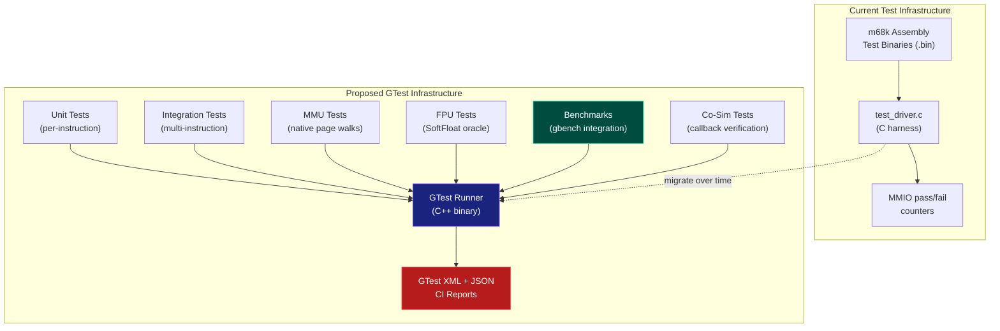
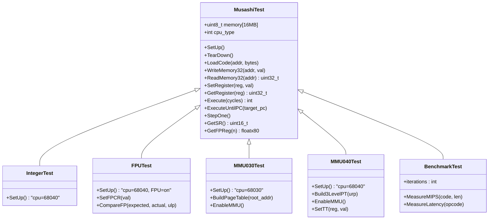
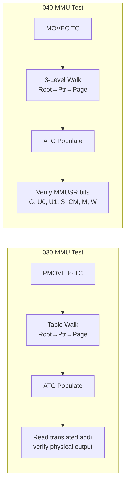
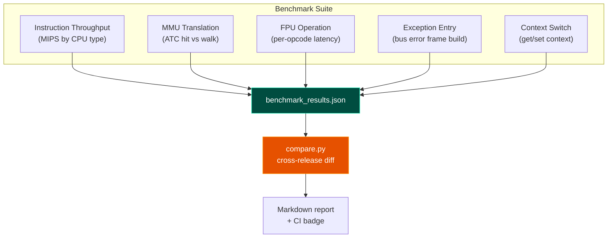
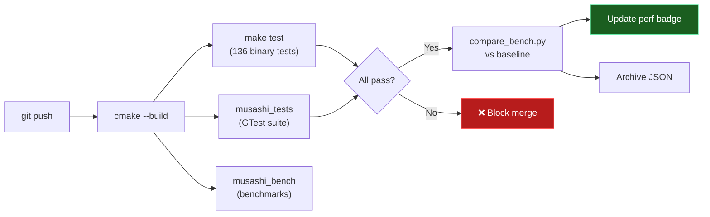

# Musashi GTest Testing Strategy

## Overview

This document defines a comprehensive Google Test (GTest) framework for the Musashi 68000-series CPU emulator. The framework complements the existing m68k binary test harness with native C++ tests that can directly inspect emulator internals, measure performance, and enable regression tracking across releases.



### Infrastructure Evolution

The transition from a pure assembly-based harness to a native GTest/C++ infrastructure represents a major shift in verification fidelity and developer productivity.

#### 1. How It Works
Unlike the legacy harness—which treats the CPU as a "black box" that executes a binary and checks MMIO results—the GTest suite is **linked directly** against the Musashi C objects.
- **Direct State Access**: Tests can inspect registers (D0-D7, SR, PC) and internal state (CPU type, cycle counts) without needing to output them to a memory map.
- **Micro-Verification**: We can verify single instructions or even sub-routines (like the MMU table walk) in isolation.
- **SoftFloat Oracle**: For FPU verification, we link a reference SoftFloat implementation. Every FPU result is checked against this "Ground Truth" oracle, catching subtle rounding or precision errors that manual assembly tests would miss.

#### 2. Integration & Workflow
- **Unified Build System**: The entire suite is managed by CMake, allowing it to build seamlessly on macOS, Linux, and Windows/WSL.
- **CI Readiness**: The GTest runner outputs standardized XML (compatible with GitHub Actions) and JSON (for performance tracking), enabling automated pass/fail gates and regression detection on every commit.
- **Developer Productivity**: GTest's `--gtest_filter` allows developers to run only the tests relevant to their current work (e.g., just FPU tests), reducing the feedback loop from minutes to seconds.

#### 3. Strategic Value
- **Regression Locking**: Every bug fixed is added as a "Regression Test," ensuring that performance optimizations or new features never break existing parity.
- **Architectural Parity**: By combining hand-written edge cases (GTest) with exhaustive bulk vectors (SST), we achieve a level of confidence required for MiSTer FPGA parity.
- **Performance Baselines**: The `musashi_bench` suite provides automated throughput tracking, ensuring that internal code cleanups don't negatively impact emulation speed.

---

---

## Architecture

### Directory Structure

```
musashi/
├── test/
│   ├── mc68000/          # Existing m68k binary tests (68000)
│   ├── mc68030/          # Existing m68k binary tests (030 MMU)
│   ├── mc68040/          # Existing m68k binary tests (040 MMU)
│   ├── mc68060/          # Existing m68k binary tests (060)
│   ├── test_driver.c     # Existing C harness
│   ├── gtest/            # Native GTest suite
│   │   ├── CMakeLists.txt
│   │   ├── test_harness.h       # Shared test fixture (MusashiTest base)
│   │   ├── test_harness.cpp     # Memory model, init, helpers
│   │   ├── test_integer.cpp     # Integer ISA unit tests
│   │   ├── test_fpu.cpp         # FPU operation tests
│   │   ├── test_mmu_030.cpp     # 030 MMU native tests
│   │   ├── test_mmu_040.cpp     # 040 MMU native tests
│   │   ├── test_exceptions.cpp  # Exception frame tests
│   │   ├── test_privileged.cpp  # MOVEC, supervisor mode
│   │   ├── test_callbacks.cpp   # Co-sim callback verification
│   │   ├── test_regression.cpp  # Bug regression tests
│   │   ├── bench_execute.cpp    # Benchmark: instruction throughput
│   │   ├── bench_mmu.cpp        # Benchmark: MMU translation
│   │   └── golden/              # Golden reference data files
│   │       ├── fpu_vectors.json
│   │       └── mmu_walks.json
│   └── singlestep/       # NEW: Bulk regression harness
│       ├── README.md
│       ├── sst_runner.sh # Bootstrap script
│       ├── data/         # Raw vectors (680x0/, m68000/)
│       ├── unified/      # Normalized .sst (tomharte/, raddad/)
│       ├── reports/      # Auto-generated failure reports
│       ├── sst_loader.c/h
│       └── sst_runner.c
├── tools/
│   └── sst_convert.py    # Unified SST converter
├── CMakeLists.txt        # Root CMake (wraps existing Makefile)
└── doc/testing/
    ├── testing_strategy.md         # This document
    ├── test_plan_overview.md       # Global index & summary
    ├── test_plan_integer.md        # Integer ISA (68000/020)
    ├── test_plan_fpu.md            # FPU operations
    ├── test_plan_mmu_030.md        # 030 MMU
    ├── test_plan_mmu_040.md        # 040 MMU
    ├── test_plan_system.md         # Exceptions/System
    ├── test_plan_singlestep.md     # SST bulk regression
    └── singlestep_harness_design.md # SST harness internals
```

### Test Fixture Design



---

## Test Categories

### 1. Integer ISA Unit Tests

Native tests that inject opcode bytes, execute one instruction, and check register/flag state.

| Test Group | Scope | Method | Count (est.) |
|------------|-------|--------|-------------|
| Data Movement | MOVE, MOVEA, MOVEQ, MOVEM, MOVEP, LEA, PEA, EXG, SWAP | Inject opcode → StepOne → check Dn/An/flags | ~80 |
| Arithmetic | ADD, SUB, MUL, DIV, NEG, CMP, TST, CLR, EXT | Each size (B/W/L), each EA mode, flag verification | ~120 |
| Logic | AND, OR, EOR, NOT | Each size, each EA mode | ~40 |
| Shift/Rotate | ASL, ASR, LSL, LSR, ROL, ROR, ROXL, ROXR | Register/immediate/memory forms, X flag | ~60 |
| BCD | ABCD, SBCD, NBCD, PACK, UNPK | X flag, carry chains, edge cases | ~20 |
| Bitfield (020+) | BFCHG, BFCLR, BFEXTS, BFEXTU, BFFFO, BFINS, BFSET, BFTST | Offset/width combos, register and memory | ~40 |
| Branch | Bcc, DBcc, Scc, BRA, BSR, JMP, JSR, RTS, RTR, RTD | Condition codes, displacement sizes | ~50 |
| Compare-Swap | CAS, CAS2 | Match/no-match, flags, LK bit | ~10 |
| MOVE16 | All 5 forms | 16-byte alignment, transfer integrity | ~10 |
| TRAPcc, CHK, CHK2 | Trap conditions | Exception vector, stack frame | ~15 |

**Example Test:**

```cpp
TEST_F(IntegerTest, MOVEQ_PositiveValue) {
    // MOVEQ #42, D3  → opcode 0x7600 | (42 & 0xFF) → 0x762A
    LoadCode(0x10000, {0x76, 0x2A});
    StepOne();
    EXPECT_EQ(GetRegister(M68K_REG_D3), 42u);
    EXPECT_EQ(GetSR() & 0x0F, 0x00);  // N=0, Z=0, V=0, C=0
}

TEST_F(IntegerTest, MOVEQ_NegativeValue) {
    // MOVEQ #-1, D0  → 0x70FF
    LoadCode(0x10000, {0x70, 0xFF});
    StepOne();
    EXPECT_EQ(GetRegister(M68K_REG_D0), 0xFFFFFFFF);
    EXPECT_TRUE(GetSR() & 0x08);  // N=1
}
```

---

### 2. FPU Tests (SoftFloat Oracle)

Native tests that verify FPU operations against independently computed SoftFloat results.

| Test Group | Method | Key Vectors |
|------------|--------|-------------|
| Basic ops (FADD, FSUB, FMUL, FDIV) | Compare REG_FP[dst] against SoftFloat result | ±0, ±∞, NaN, denormals, max/min |
| FSQRT | Edge cases: 0, 1, negative, denorm | IEEE 754 reference |
| FINT/FINTRZ | All four rounding modes via FPCR | 1.5, 2.5, -1.5, -2.5, boundary |
| Fs*/Fd* variants | Verify single/double precision rounding | Compare extended→single→extended round-trip |
| FPCR rounding mode | Set FPCR, execute FADD, verify rounding | RN, RZ, RM, RP for each op |
| FPCR precision | Set precision bits, verify floatx80_rounding_precision | 32-bit, 64-bit, 80-bit |
| FMOVECR (030 only) | All 22 constants | Bit-exact comparison to Motorola spec |
| Condition codes | FPCC after each op | N, Z, I, NAN for special values |
| 040 F-line trap | Execute FSIN on 040 | Verify exception vector 11 fired |
| Packed decimal trap | FMOVE FP0 to packed on 040 | Verify F-line trap |

**Example Test:**

```cpp
TEST_F(FPUTest, FADD_RoundingModes) {
    // Set up two floatx80 values that produce different results under RN vs RZ
    floatx80 a = int32_to_floatx80(1);
    floatx80 b = /* carefully chosen value near rounding boundary */;

    for (int mode = 0; mode < 4; mode++) {
        SetFPCR(mode << 4);           // Set rounding mode
        SetFPReg(0, a);
        SetFPReg(1, b);
        LoadCode(0x10000, FADD_FP1_FP0);  // FADD FP1,FP0
        StepOne();

        float_rounding_mode = mode;   // Set SoftFloat independently
        floatx80 expected = floatx80_add(a, b);
        EXPECT_FP_EQ(GetFPReg(0), expected)
            << "Rounding mode " << mode;
    }
}
```

---

### 3. MMU Tests (Native Page Table Construction)

Build page tables in host memory, enable MMU, verify translations, faults, and ATC behavior.



| Test Group | Scope | Verification |
|------------|-------|-------------|
| Identity map | VA=PA, 4K/8K pages | Read/write through MMU matches direct |
| Non-identity | VA≠PA | Read at VA returns data from PA |
| WP violation | Write to WP page | Bus error, Format $7/$B frame |
| Supervisor-only | User-mode access to S page | Bus error |
| U/M bit writeback | Walk sets U/M in descriptor | Read back PTE, verify bits |
| Global pages | PFLUSHN preserves G entries | ATC lookup after flush |
| TT matching | Address in TT range | Transparent pass-through |
| ATC eviction | Fill beyond capacity | LRU victim correct |
| Multi-level indirect | Indirect descriptors | Correct physical resolution |
| TC disable/enable | Toggle E bit | ATC flushed on enable |

---

### 4. Exception & Stack Frame Tests

| Test | Method | Verification |
|------|--------|-------------|
| Format $0 (TRAP #n) | Execute TRAP #0 | SP-=8, format=$0, vector=32 |
| Format $2 (interrupt) | m68k_set_irq(5) | SP-=12, format=$2, saved SR |
| Format $7 (040 bus error) | Write to unmapped addr on 040 | 30-word frame, SSW bits correct |
| Format $B (030 bus error) | Write to unmapped addr on 030 | 46-word frame, SSW with FC/DF/RW |
| SSW LK bit | CAS to faulting addr | LK=1 in SSW |
| Privilege violation | Execute MOVEC in user mode | Vector 8, Format $0 |
| Address error | Word read from odd address | Vector 3 |
| F-line trap | Execute FSIN on 040 | Vector 11 |
| Divide by zero | DIVS #0, Dn | Vector 5 |
| RTE | Build frame, execute RTE | SR/PC restored, SP adjusted |

---

### 5. Co-Simulation Callback Tests

Verify that the co-sim hooks fire with correct arguments.

```cpp
// Capture callback invocations
static std::vector<TranslateEvent> g_translate_events;
void mock_translate_cb(unsigned int logical, unsigned int physical,
                       unsigned char fc, unsigned char access,
                       unsigned char cache_mode, unsigned char from_atc,
                       unsigned int mmusr) {
    g_translate_events.push_back({logical, physical, fc, cache_mode, from_atc});
}

TEST_F(MMU040Test, CoSim_TranslateOnATCHit) {
    m68k_set_mmu_translate_callback(mock_translate_cb);
    BuildIdentityMap();
    EnableMMU();
    g_translate_events.clear();

    // Execute a load — should hit ATC on second access
    LoadCode(0x10000, LDR_FROM_MAPPED_ADDR);
    Execute(100);

    ASSERT_GE(g_translate_events.size(), 1u);
    EXPECT_EQ(g_translate_events[0].logical & ~0xFFF,
              g_translate_events[0].physical & ~0xFFF);
}
```

| Callback | Events to Verify |
|----------|-----------------|
| `mmu_translate` | Fires on ATC hit, table walk completion |
| `mmu_atc` | INSERT on walk, FLUSH on PFLUSH/PFLUSHA |
| `mmu_fault` | BUS_ERROR with correct address and FC |
| `pc_changed` | Fires on branch, exception, RTE |
| `fc_changed` | User↔supervisor transitions |
| `tas_callback` | Fires on TAS, can block writeback |

---

### 6. Regression Tests

Each fixed bug gets a permanent test to prevent recurrence.

| Bug ID | Description | Test |
|--------|-------------|------|
| FSSQRT_MAP | Fs*/Fd* opmode bit-mask mapped FSSQRT→FINT | Execute FSSQRT, verify √4=2 |
| FSGLDIV_HOST | FSGLDIV used host (float) cast | Compare vs SoftFloat oracle |
| LC040_MACRO | CPU_TYPE_LC040 missing from _PLUS macros | Set cpu=LC040, execute 040 insn |
| MOVE16_ALIGN | MOVE16 not 16-byte aligned | Source addr 0x1003 → read from 0x1000 |
| PACKED_040 | Packed decimal not trapped on 040 | FMOVE to packed → F-line trap |
| SSW_LK | SSW LK bit not set for CAS | CAS to fault addr → check LK in SSW |
| FPCR_PREC | FPCR precision bits not wired | Set FPCR[7:6]=01, verify SP rounding |

---

## Benchmarking Framework

### Design

Use Google Benchmark (`benchmark::`) for micro-benchmarks integrated alongside GTest.



### Benchmark Definitions

| Benchmark | What it Measures | Setup |
|-----------|-----------------|-------|
| `BM_Execute_NOP` | Raw dispatch overhead | 1M NOPs in a loop |
| `BM_Execute_ADD` | Integer ALU throughput | 1M ADD.L D0,D1 |
| `BM_Execute_MUL` | Multiply latency | 1M MULS instructions |
| `BM_Execute_DIV` | Divide latency | 1M DIVS instructions |
| `BM_Execute_MOVE16` | Block transfer perf | 1M MOVE16 (Ax)+,(Ay)+ |
| `BM_FPU_FADD` | FPU add throughput | 1M FADD FP0,FP1 |
| `BM_FPU_FDIV` | FPU divide throughput | 1M FDIV |
| `BM_FPU_FSQRT` | FPU sqrt throughput | 1M FSQRT |
| `BM_MMU_ATCHit` | Translation cache hit | Repeated access to same page |
| `BM_MMU_TableWalk` | Full 3-level walk | Thrash ATC, force walks |
| `BM_MMU_TT` | TT match fast-path | Access in TT range |
| `BM_Exception_BusError` | Format $7 frame build | Repeated bus errors |
| `BM_Exception_Trap` | TRAP dispatch | 1M TRAP #0 |
| `BM_Context_SaveRestore` | Context switch cost | get_context/set_context |

### Cross-Release Comparison

```
# Run benchmarks with JSON output:
./musashi_bench --benchmark_format=json --benchmark_out=v2.3.json

# Compare against baseline:
python3 tools/compare_bench.py --baseline v2.2.json --current v2.3.json

# Output:
┌──────────────────┬───────────┬───────────┬──────────┐
│ Benchmark        │ v2.2 (ns) │ v2.3 (ns) │ Change   │
├──────────────────┼───────────┼───────────┼──────────┤
│ BM_Execute_NOP   │     12.3  │     11.8  │  -4.1%   │
│ BM_Execute_ADD   │     15.7  │     15.2  │  -3.2%   │
│ BM_FPU_FADD      │     48.2  │     52.1  │  +8.1% ⚠ │
│ BM_MMU_ATCHit    │     23.4  │     22.9  │  -2.1%   │
│ BM_MMU_TableWalk │    156.8  │    142.3  │  -9.3%   │
└──────────────────┴───────────┴───────────┴──────────┘
```

---

## CPU Mode Matrix

All tests run across every relevant CPU type to catch mode-specific regressions.

| Test Suite | 68000 | 68010 | EC020 | 68020 | 68030 | EC040 | LC040 | 68040 | EC060 | LC060 | 68060 |
|------------|:-----:|:-----:|:-----:|:-----:|:-----:|:-----:|:-----:|:-----:|:-----:|:-----:|:-----:|
| Integer (base) | ✅ | ✅ | ✅ | ✅ | ✅ | ✅ | ✅ | ✅ | ✅ | ✅ | ✅ |
| Integer (020+) | — | — | ✅ | ✅ | ✅ | ✅ | ✅ | ✅ | ✅ | ✅ | ✅ |
| Bitfield       | — | — | ✅ | ✅ | ✅ | ✅ | ✅ | ✅ | ✅ | ✅ | ✅ |
| FPU (full)     | — | — | — | opt* | opt* | — | — | ✅ | — | — | ✅ |
| FPU (trap)     | — | — | — | — | — | ✅ | ✅ | — | ✅ | ✅ | — |
| MMU 030        | — | — | — | — | ✅ | — | — | — | — | — | — |
| MMU 040        | — | — | — | — | — | — | ✅ | ✅ | — | ✅ | ✅ |
| MOVE16         | — | — | — | — | — | ✅ | ✅ | ✅ | ✅ | ✅ | ✅ |
| Exceptions     | ✅ | ✅ | ✅ | ✅ | ✅ | ✅ | ✅ | ✅ | ✅ | ✅ | ✅ |
| Co-Sim         | ✅ | ✅ | ✅ | ✅ | ✅ | ✅ | ✅ | ✅ | ✅ | ✅ | ✅ |
| Benchmarks     | ✅ | ✅ | ✅ | ✅ | ✅ | ✅ | ✅ | ✅ | ✅ | ✅ | ✅ |

* FPU instructions supported via external 68881/68882 coprocessor.

---

## Build Integration

### CMakeLists.txt (Root)

```cmake
cmake_minimum_required(VERSION 3.14)
project(musashi_tests LANGUAGES C CXX)

set(CMAKE_CXX_STANDARD 17)

# Fetch GTest + Google Benchmark
include(FetchContent)
FetchContent_Declare(googletest
    GIT_REPOSITORY https://github.com/google/googletest.git
    GIT_TAG v1.14.0)
FetchContent_Declare(googlebenchmark
    GIT_REPOSITORY https://github.com/google/benchmark.git
    GIT_TAG v1.8.3)
FetchContent_MakeAvailable(googletest googlebenchmark)

# Musashi core as a static library
add_library(musashi_core STATIC
    m68kcpu.c m68kops.c m68kdasm.c softfloat/softfloat.c)
target_include_directories(musashi_core PUBLIC ${CMAKE_SOURCE_DIR})
target_compile_definitions(musashi_core PUBLIC M68K_COMPILE_FOR_MAME=0)

# GTest binary
file(GLOB TEST_SOURCES test/gtest/test_*.cpp)
add_executable(musashi_tests ${TEST_SOURCES}
    test/gtest/test_harness.cpp)
target_link_libraries(musashi_tests musashi_core GTest::gtest_main)

# Benchmark binary
file(GLOB BENCH_SOURCES test/gtest/bench_*.cpp)
add_executable(musashi_bench ${BENCH_SOURCES}
    test/gtest/test_harness.cpp)
target_link_libraries(musashi_bench musashi_core benchmark::benchmark_main)

# CTest integration
include(GoogleTest)
gtest_discover_tests(musashi_tests)
```

### CI Pipeline



---

## Implementation Roadmap

| Phase | Scope | Effort | Priority |
|-------|-------|--------|----------|
| **Phase 1** | CMake build, test harness, 20 integer smoke tests | 2 days | HIGH |
| **Phase 2** | FPU test suite with SoftFloat oracle (40 tests) | 2 days | HIGH |
| **Phase 3** | MMU 030/040 native tests (30 tests) | 2 days | HIGH |
| **Phase 4** | Exception/stack frame tests (15 tests) | 1 day | HIGH |
| **Phase 5** | Regression tests for all 11 fixed bugs | 1 day | HIGH |
| **Phase 6** | Co-sim callback verification (10 tests) | 1 day | MEDIUM |
| **Phase 7** | Google Benchmark integration (15 benchmarks) | 1 day | MEDIUM |
| **Phase 8** | Cross-release comparison tooling | 1 day | MEDIUM |
| **Phase 9** | CI pipeline (GitHub Actions) | 0.5 day | MEDIUM |
| **Phase 10** | Full instruction coverage (400+ tests) | Ongoing | LOW |

---

## Test Naming Convention

```
TEST_F(Suite, CPUType_Instruction_Variant_Condition)

Examples:
  TEST_F(IntegerTest, 040_MOVE16_AbsToAx_Aligned)
  TEST_F(FPUTest, 040_FSSQRT_OpmodeLookup)
  TEST_F(MMU040Test, Walk4K_WriteProtect_BusError)
  TEST_F(ExceptionTest, 040_Format7_SSW_LK_CAS)
  TEST_F(RegressionTest, Bug_FSSQRT_MappedToFINT)
```

---

## Running Tests

```bash
# Build everything
cmake -B build -DCMAKE_BUILD_TYPE=Release
cmake --build build -j$(nproc)

# Run all GTests
./build/musashi_tests

# Run with filter
./build/musashi_tests --gtest_filter="FPUTest.*"
./build/musashi_tests --gtest_filter="*Regression*"

# Run with GTest XML output (for CI)
./build/musashi_tests --gtest_output=xml:test_results.xml

# Run benchmarks
./build/musashi_bench --benchmark_format=json \
    --benchmark_out=bench_$(git rev-parse --short HEAD).json

# Compare benchmarks
python3 tools/compare_bench.py \
    --baseline bench_abc1234.json \
    --current bench_def5678.json \
    --threshold 5.0

# Run legacy tests too
make test
```

## Bulk Regression Strategy (SingleStepTests)

While hand-written GTests cover architectural edge cases and complex subsystems (FPU/MMU), the **SingleStepTests (SST)** harness provides exhaustive coverage of the base integer ISA.

### 1. The Dataset
We utilize over **1.3 million** test vectors sourced from:
- **TomHarte/680x0**: Focuses on deep architectural state (8,000 vectors per mnemonic).
- **raddad772/m68k**: Includes address error bus cycle parity and cross-validation vectors.

### 2. High-Speed Verification
The `sst_runner` is a specialized C binary designed for maximal throughput:
- **No GTest overhead**: Uses a custom, minimal test loop.
- **Flat Binary Format**: Reads normalized `.sst` files directly into memory-mapped structures.
- **MMIO Mocking**: Implements a high-speed memory map to capture reads/writes without full bus simulation.

### 3. Integrated Failure Reporting
Failures in the bulk suite are automatically exported to `test/singlestep/reports/` in multiple formats (Markdown, HTML, JSON). This allows developers to:
1. Identify the failing opcode.
2. View the exact register/memory mismatch.
3. Isolate the regression using the hand-written GTest suite for white-box debugging.

---

## Running the Suite

The holistic testing workflow is:

1. **Quick Check**: `./build/musashi_tests` (Hand-written edge cases).
2. **Deep Regression**: `./test/singlestep/sst_runner.sh --all --summary` (1.3M architectural vectors).
3. **Performance**: `./build/musashi_bench` (Throughput baselines).
